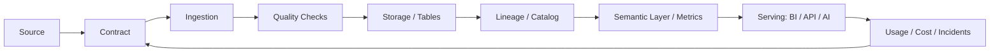

# 数据治理控制点图

## 控制点说明

- `Contract`：约束上游 schema、语义、SLA 和变更方式
- `Quality Checks`：在数据进入关键表和核心指标前发现问题
- `Lineage / Catalog`：让影响范围和责任边界可见
- `Semantic Layer / Metrics`：让指标口径可复用，而不是每个看板重写
- `Usage / Cost / Incidents`：把实际使用、成本和事故反馈到治理规则

## 关联

- [[../05-Topics/数据治理与指标可信度|数据治理与指标可信度]]
- [[../05-Topics/数据生命周期与 Data Lifecycle|数据生命周期与 Data Lifecycle]]

