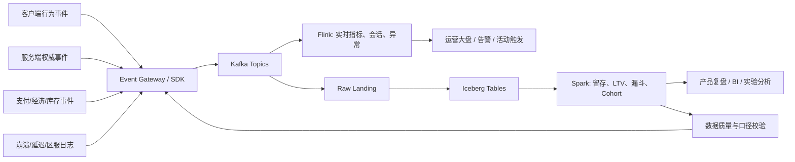

# 游戏实时运营指标链路图

## 读图要点

- 客户端事件适合补体验细节，服务端事件负责关键事实校准
- Kafka 让高吞吐行为、战斗、经济、质量和运营事件解耦复用
- Flink 适合实时观察、窗口聚合、异常检测和活动监控
- Iceberg / Lakehouse 保存版本、活动、实验和行为历史
- Spark 做留存、LTV、漏斗、cohort、活动 ROI 和长期复盘

## 关联

- [[../09-Case-Studies/游戏实时运营指标链路|游戏实时运营指标链路]]
- [[../05-Topics/Kafka 与事件日志|Kafka 与事件日志]]
- [[../05-Topics/Flink 与流处理|Flink 与流处理]]
- [[../05-Topics/Spark 与批处理|Spark 与批处理]]
- [[../05-Topics/Apache Iceberg 与 Lakehouse 表格式|Apache Iceberg 与 Lakehouse 表格式]]

