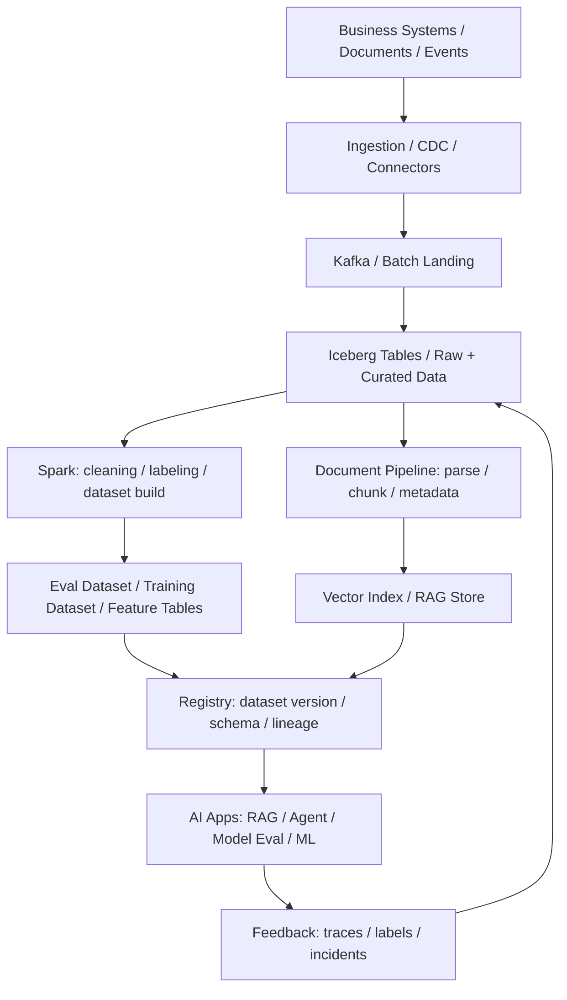

# AI 数据供给链路

## 这页解决什么问题

这页把大数据和 AI 工程接起来：

> 一个企业要做 RAG、agent、eval、fine-tuning 或 feature-based ML 时，数据平台应该怎样供给可信、可版本化、可追溯的数据？

它不是模型训练教程，而是 AI 系统背后的数据供给工作台。

## 业务目标

AI 数据供给链路通常要同时满足：

- 可信：数据来源、owner、权限、更新时间清楚
- 可追溯：模型输出、RAG 引用、eval 结果能追到数据版本
- 可版本化：dataset、document chunk、feature、label、eval case 都可复现
- 可更新：事实源变化后，索引、特征、评测集和下游系统能同步
- 可隔离：训练、评测、线上检索、敏感数据和用户数据边界清楚
- 可治理：隐私、权限、保留期限、删除请求和审计链路可执行

## 端到端链路

## 1. Source：AI 需要哪些数据

AI 数据供给不是只给模型“喂文本”。

常见来源包括：

- 业务数据库：客户、订单、合同、工单、支付、库存、账户
- 企业文档：政策、产品手册、FAQ、合同、报告、知识库
- 事件流：用户行为、系统日志、agent trace、工具调用
- 标注数据：人工审核、偏好反馈、分类标签、质量判断
- 评测数据：golden set、regression cases、incident-fed evals
- 外部数据：市场、监管、供应商、公开资料

第一原则：AI 使用的数据必须知道“来自哪里、谁负责、什么时候更新、能不能用于这个场景”。

## 2. Ingestion：采集和同步

AI 数据链路常见采集方式：

- batch import：周期性导入业务表和文件
- CDC：同步业务数据库变更
- connector：同步 Google Drive、Confluence、Notion、SharePoint 等文档
- event stream：采集用户行为、agent trace、线上反馈
- manual labeling：引入人工标注和审核结果

关键问题：

- schema / document structure 是否稳定
- 权限和敏感字段是否在采集阶段保留
- 删除、撤回、过期和更正如何传播
- 文档更新后下游索引是否可增量刷新

## 3. Lakehouse：统一原始与整理数据

AI 数据不应该只存在 vector store 或临时文件里。

Lakehouse 层保存：

- raw source snapshots
- normalized tables
- document metadata
- parsed text
- chunk records
- labels
- eval cases
- feature tables
- trace and feedback data

Iceberg 类表格式的价值：

- dataset snapshot 可复现
- schema evolution 可控
- 删除和更正更可追踪
- Spark / Flink / Trino / AI pipeline 可以共用同一底座

## 4. Document Pipeline：从文档到 RAG

RAG 数据链路至少包含：

- parse：解析 PDF、HTML、Markdown、Office 文档
- clean：去噪、去重复、处理页眉页脚和表格
- chunk：按语义、章节、权限和引用需求切块
- metadata：保留来源、版本、权限、更新时间、owner
- embedding：向量化
- index：写入 vector store 或 hybrid search

关键判断：

- chunk 是否能独立回答问题
- metadata 是否足够支持权限和引用
- 文档更新是否能定位受影响 chunk
- 线上答案是否能追溯到原文版本

## 5. Dataset Build：训练、评测与特征

AI 数据供给至少分三类：

### RAG / Agent 事实数据

- 企业知识
- 工具 schema
- 政策与流程
- 业务事实源

核心要求：freshness、权限、引用、可追溯。

### Eval Data

- golden questions
- regression cases
- incident-fed cases
- adversarial cases
- domain-specific scoring rubrics

核心要求：版本、覆盖、代表性、不可泄漏到训练数据。

### Training / Feature Data

- fine-tuning examples
- labeled conversations
- user feedback
- tabular features
- behavior aggregates

核心要求：样本质量、标签一致性、隐私边界、训练 / 推理一致性。

## 6. Registry：数据版本和血缘

AI 数据必须注册，而不是散在脚本里。

Registry 至少记录：

- dataset name
- version
- source tables / documents
- schema
- generation job
- owner
- permission class
- intended use
- evaluation results
- dependent models / apps

没有 registry，就无法回答：

- 这个 agent 用的是哪版知识
- 这个 eval 分数对应哪版数据
- 某份合同删除后影响了哪些索引和模型
- 某个线上错误是否来自过期数据

## 7. Serving：数据怎样进入 AI 系统

常见服务形态：

- vector index：RAG 检索
- search index：keyword / hybrid search
- feature store：模型特征
- dataset API：训练和评测任务读取
- policy / tool metadata service：agent 工具和规则上下文
- feedback stream：线上 trace 和用户反馈回流

每种服务都要定义：

- freshness
- latency
- permission
- fallback
- audit
- rollback

## 8. Feedback：线上反馈回流

AI 系统上线后，反馈也是数据。

需要回流：

- user feedback
- human review
- tool call success / failure
- retrieval hit / miss
- hallucination incidents
- policy violations
- latency and cost traces

这些反馈应该进入：

- eval dataset
- prompt / policy revision
- retrieval tuning
- document quality improvement
- training data candidate pool

## 最关键的架构判断

### 判断 1：AI 用的是事实源还是副本

- 高风险答案必须回到权威事实源
- 文档索引是服务层，不应替代源系统
- 过期文档、撤回文档和权限变化必须能传播

### 判断 2：RAG、Eval、Training 数据要分开

- RAG 需要 freshness 和权限
- Eval 需要代表性和稳定版本
- Training 需要质量、标签和隐私边界
- 三者混在一起会造成泄漏、不可复现和评估失真

### 判断 3：谁对 AI 数据负责

AI 数据 owner 不能只落在模型团队。

通常需要：

- business owner：定义事实和口径
- data platform owner：保证管道、质量、血缘
- AI engineering owner：定义使用方式、eval 和上线门槛
- security / privacy owner：管理权限和敏感数据

## 这条链路最容易失败在哪里

1. 只建 vector store，没有保留 source snapshot 和版本
2. 文档 chunk 没有权限和 owner，导致越权回答
3. eval dataset 和训练数据污染，分数虚高
4. 数据更新没有传播到索引和 eval，系统长期用旧知识
5. 线上失败没有回流成 regression case
6. 删除和撤回请求无法追踪到下游索引
7. prompt、dataset、model、retrieval index 版本没有绑定

## 这页应该教会什么

- AI 数据供给是数据平台问题，不只是模型工程问题
- Vector store 是服务层，不是数据治理底座
- Eval data、RAG data、training data 必须分清
- Dataset registry 和 lineage 是 AI 系统可复现的基础
- 线上 feedback 应该反哺 eval、retrieval、document quality 和训练候选集

## 关联

- [[../05-Topics/数据生命周期与 Data Lifecycle|数据生命周期与 Data Lifecycle]]
- [[../05-Topics/Apache Iceberg 与 Lakehouse 表格式|Apache Iceberg 与 Lakehouse 表格式]]
- [[../05-Topics/Spark 与批处理|Spark 与批处理]]
- [[../05-Topics/数据治理与指标可信度|数据治理与指标可信度]]
- [[../../AI-Engineering/07-Topics/Prompt Registry、Datasets 与 Evals|Prompt Registry、Datasets 与 Evals]]
- [[../../AI-Engineering/07-Topics/LLMOps、AgentOps 与 Observability|LLMOps、AgentOps 与 Observability]]

