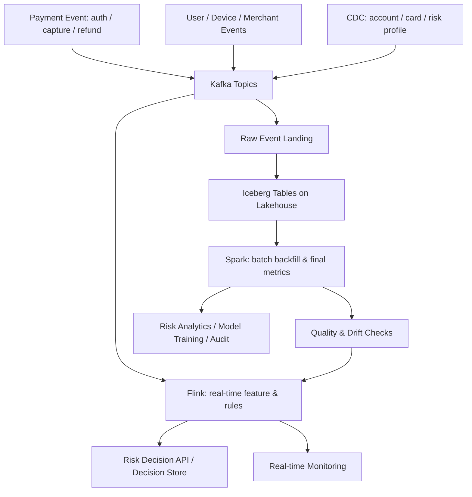

# 支付实时风控数据链路

## 这页解决什么问题

这页用一个真实感更强的场景，把大数据主干串起来：

> 当一笔支付发生时，系统如何在秒级做风险判断，同时保留可回放、可审计、可校准的数据链路？

它不是支付业务全解，而是大数据系统练习样本。

## 业务目标

支付实时风控通常要同时满足：

- 低延迟：支付授权前后要快速给出风险判断
- 可解释：拒绝、挑战、放行要能说明依据
- 可回放：规则和模型更新后能回看历史效果
- 可校准：实时判断要和离线最终口径对齐
- 可审计：关键决策需要保留证据链
- 可治理：敏感数据、权限、指标口径都要受控

## 端到端链路

## 1. Source：哪些数据进入链路

核心数据源：

- 支付事件：authorization、capture、refund、chargeback
- 用户行为：登录、设备变更、地址变更、异常点击
- 商户与订单：商品、金额、币种、国家、MCC、历史拒付率
- 账户与卡：账户年龄、卡 BIN、发卡国家、历史交易
- 风控反馈：人工审核结果、拒付、欺诈确认、误杀申诉

第一原则：风控数据必须能回到明确事实源，否则后续无法审计和校准。

## 2. Kafka：事件日志层

Kafka 在这里承担事件轨道：

- 支付事件 topic：低延迟、高可靠、关键业务事件
- 用户行为 topic：高吞吐、可用于实时特征
- CDC topic：账户、商户、风控配置等状态变化
- 风控反馈 topic：人工审核、拒付、欺诈标签回流

关键设计：

- partition key 通常围绕 `user_id / account_id / payment_id / merchant_id`
- schema 需要兼容演进
- retention 要覆盖事故回放和模型回测窗口
- topic owner 要清楚，否则事件含义会漂移

## 3. Flink：实时状态与风险特征

Flink 负责低延迟状态计算：

- 最近 5 分钟交易次数
- 同一设备多账户尝试
- 同一卡跨地区异常
- 用户行为到支付的时间间隔
- 商户短期拒付风险变化
- CDC 状态和实时事件 join

这里最重要的是 `event time`、`state` 和 `checkpoint`。

风控不是只看单笔交易，而是看“这笔交易发生时，账户、设备、商户和历史行为处于什么状态”。

## 4. Decision：实时决策层

实时风控结果可能进入：

- 放行
- 拒绝
- 3DS / SCA challenge
- 人工审核
- 降额、限频、延迟发货

大数据链路不一定直接做业务动作，但必须提供：

- 特征值
- 规则命中
- 模型分数
- 决策原因
- 数据版本
- 决策时间

否则后续无法解释为什么当时做了这个判断。

## 5. Iceberg / Lakehouse：可回放与可审计底座

实时链路之外，需要把原始事件、实时输出和最终结果落到 lakehouse：

- raw payment events
- raw user / device events
- risk feature snapshots
- risk decision logs
- manual review labels
- chargeback / fraud outcomes

Iceberg 类表格式的价值：

- snapshot：保留历史版本
- schema evolution：适应事件字段变化
- partition evolution：优化后续查询
- time travel：支持回溯分析
- 多引擎读取：Spark、Flink、Trino 等可协作

## 6. Spark：离线校准与历史重算

Spark 负责批处理和最终口径：

- 历史交易重算
- 风控规则回测
- 误杀率 / 漏杀率分析
- chargeback 后验标签回填
- 训练集和 eval dataset 生成
- 与财务、客服、运营数据做大规模 join

这一步很关键：实时结果快，但最终评估通常依赖离线标签和更完整事实。

## 7. Governance：为什么组织能信

支付风控链路必须治理：

- 指标定义：fraud rate、chargeback rate、false positive、approval rate
- owner：支付、风控、数据平台、合规分别负责什么
- lineage：某个拒绝决策依赖哪些事件、特征、规则和模型版本
- quality：关键 topic 是否延迟、缺字段、重复、异常分布
- access：敏感字段、卡信息、PII、风控规则权限
- retention：交易、决策、审核和申诉数据保存多久

没有治理，实时风控会变成“很快但没人敢完全信”的黑盒。

## 最关键的架构判断

### 判断 1：哪些必须实时

必须实时：

- 授权前风险判断
- 异常交易拦截
- 高频攻击检测

不一定实时：

- 月度风控复盘
- 模型训练
- 最终财务口径
- 监管或审计报表

### 判断 2：哪些必须离线校准

必须离线校准：

- chargeback 结果
- 人工审核标签
- 误杀与漏杀分析
- 规则调整效果
- 模型训练与回测

### 判断 3：实时和离线如何对齐

对齐方式：

- 同一套 feature definition
- 决策日志落盘
- 规则和模型版本记录
- batch 回补实时缺失
- 离线结果反哺实时规则

## 这条链路最容易失败在哪里

1. 事件定义不清：同一个支付状态在不同系统含义不同
2. 迟到数据没处理：实时判断和最终结果长期不一致
3. 特征不可回放：线上命中特征离线无法复现
4. 决策原因没记录：拒绝和挑战无法解释
5. 权限太粗：敏感风控数据被过度暴露
6. 没有 owner：质量事故时没人负责上游修正

## 这页应该教会什么

- Kafka 负责事件轨道，不负责风控逻辑
- Flink 负责实时状态和低延迟特征，不负责最终口径
- Iceberg / lakehouse 负责可回放、可审计的数据表底座
- Spark 负责历史重算、离线校准和模型 / 指标产出
- Governance 决定组织是否敢信任这条链路

## 关联

- [[../05-Topics/Kafka 与事件日志|Kafka 与事件日志]]
- [[../05-Topics/Flink 与流处理|Flink 与流处理]]
- [[../05-Topics/Spark 与批处理|Spark 与批处理]]
- [[../05-Topics/Apache Iceberg 与 Lakehouse 表格式|Apache Iceberg 与 Lakehouse 表格式]]
- [[../05-Topics/数据治理与指标可信度|数据治理与指标可信度]]
- [[../../International-Payments/专题总览|International-Payments]]

