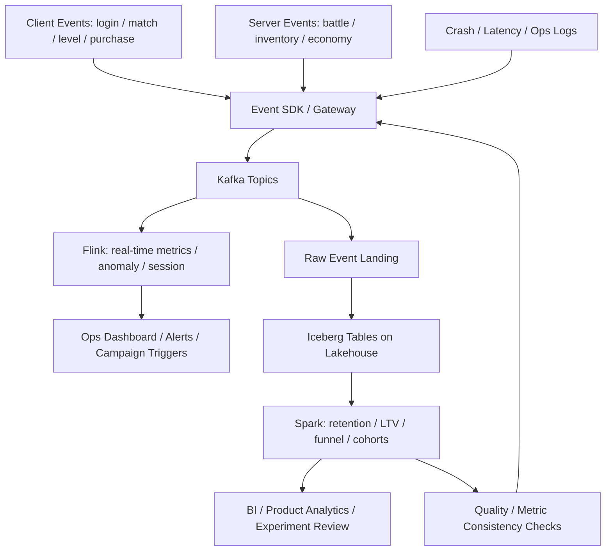

# 游戏实时运营指标链路

## 这页解决什么问题

这页用游戏运营场景，把大数据系统从“风控低延迟动作”扩展到“实时观察、运营调控和长期分析”：

> 一款在线游戏如何把行为事件、经济系统、活动效果和异常信号转成可实时监控、可回放、可复盘的数据链路？

它不是游戏业务全解，而是大数据系统的第二条贯穿案例。

## 业务目标

游戏实时运营数据链路通常要同时支持：

- 实时看板：在线人数、匹配耗时、付费、活动参与、崩溃与延迟
- 异常检测：充值异常、外挂行为、经济系统通胀、服务器异常
- 运营调控：活动效果、礼包转化、流失预警、分群触达
- 长期分析：留存、LTV、付费漏斗、关卡卡点、内容消耗
- 可回放：活动复盘、版本对比、异常事件追溯
- 可治理：指标口径统一、埋点质量、玩家隐私和权限控制

## 端到端链路

## 1. Source：游戏数据从哪里来

核心数据源：

- 客户端行为：登录、注册、点击、任务、关卡、匹配、退出
- 服务端事件：战斗结果、库存变更、货币获得与消耗、活动状态
- 付费事件：订单、支付、退款、礼包购买、订阅状态
- 体验信号：延迟、掉线、崩溃、帧率、服务器负载
- 运营配置：活动、版本、实验分组、礼包、公告、补偿
- 风险反馈：外挂、作弊、恶意刷资源、异常交易

第一原则：游戏数据不能只看客户端埋点，关键事实必须能被服务端事件校准。

## 2. Kafka：多事件源的统一事件轨道

Kafka 在这里承担事件汇聚和解耦：

- `player_behavior_events`：高吞吐玩家行为
- `battle_events`：战斗、匹配、胜负、时长
- `economy_events`：货币、道具、库存、交易
- `payment_events`：订单、支付、退款
- `ops_events`：活动、配置、实验分组
- `quality_events`：崩溃、延迟、掉线、性能

关键设计：

- partition key 通常围绕 `player_id / server_id / session_id / match_id`
- 客户端事件需要防重复、防伪造和 schema 校验
- 服务端事实事件要作为关键指标的主来源
- topic owner 要能解释事件语义，否则指标会漂移

## 3. Flink：实时指标、会话和异常

Flink 负责低延迟运营观察：

- 实时 DAU / CCU / 新增 / 回流
- 实时付费金额、订单数、转化率
- 匹配等待时间、战斗完成率、掉线率
- 活动参与人数、任务完成、礼包转化
- 经济系统中金币 / 钻石产出与消耗
- 异常充值、异常道具增长、外挂疑似行为

这里最重要的是：

- session 识别
- event time 与迟到事件
- 窗口聚合
- 去重
- 分区维度：版本、区服、渠道、国家、活动、实验组

## 4. Ops Serving：实时运营动作

实时结果可以进入：

- 运营大盘
- 告警系统
- 活动效果监控
- 分群触达
- 自动补偿或人工处理队列
- 反作弊观察台
- 服务器扩缩容或降级策略

关键边界：大多数运营指标可以实时观察，但高风险动作仍应有人工确认或规则门槛。

## 5. Iceberg / Lakehouse：行为历史和版本复盘

游戏事件最终要落到 lakehouse：

- raw client events
- server authority events
- payment and economy events
- experiment assignment
- activity config snapshots
- real-time aggregate snapshots
- anti-cheat and ops actions

Iceberg 类表格式在这里的价值：

- 保留活动期间的历史版本
- 支持版本 / 活动 / 区服 / 渠道维度复盘
- 支持 schema evolution，应对新玩法和新活动埋点
- 支持多引擎读取，让 BI、Spark、Flink、ad hoc query 共用底座

## 6. Spark：离线复盘和长期分析

Spark 负责离线计算：

- 留存：D1 / D7 / D30
- LTV 和付费分层
- 漏斗：注册 -> 新手引导 -> 首局 -> 首付
- Cohort：按版本、渠道、国家、活动、实验组
- 关卡卡点和内容消耗
- 经济系统通胀 / 通缩复盘
- 实验效果和活动 ROI

这一步通常比实时看板更接近产品决策，因为它能结合完整周期和后验结果。

## 7. Governance：为什么指标不乱

游戏数据最容易乱在：

- 客户端埋点缺失或重复
- 同一指标客户端和服务端口径不同
- 版本、区服、渠道维度口径不统一
- 活动配置变化没有进入数据口径
- 经济系统指标没有 owner
- 实验分组和活动分组混在一起

治理重点：

- 指标定义：DAU、CCU、留存、付费率、ARPU、ARPPU、LTV
- 事实源：哪些指标必须以服务端事件为准
- 埋点契约：客户端事件 schema、版本、触发时机
- 血缘：一个看板指标依赖哪些事件、任务和维表
- 质量：缺失率、重复率、延迟、异常分布、版本断点
- 权限：玩家隐私、付费数据、反作弊规则和运营配置

## 最关键的架构判断

### 判断 1：哪些需要实时

适合实时：

- CCU、在线状态、服务器异常
- 活动参与和付费波动
- 匹配耗时、掉线、崩溃
- 异常经济行为和疑似作弊

不一定实时：

- D7 / D30 留存
- 长周期 LTV
- 版本整体复盘
- 活动 ROI 最终结论

### 判断 2：客户端和服务端怎么分工

- 客户端适合记录体验和交互细节
- 服务端适合记录权威事实：支付、库存、战斗结果、货币变化
- 核心指标最好有服务端校准
- 客户端事件要有去重、防伪造和版本管理

### 判断 3：实时指标和离线指标如何对齐

对齐方式：

- 统一 metric definition
- 活动配置快照入仓
- 实验分组稳定记录
- 实时聚合落盘
- 离线任务校验实时结果
- 异常复盘反哺埋点和质量规则

## 这条链路最容易失败在哪里

1. 埋点无 owner：事件很多但没人解释含义
2. 客户端事件被当作权威事实：导致付费、库存和战斗指标失真
3. 活动配置没入仓：复盘时不知道当时活动规则是什么
4. 实时大盘和离线报表口径不同：运营和产品各信一套数
5. 维度爆炸：版本、渠道、国家、区服、实验组组合后成本失控
6. 经济系统缺少监控：资源通胀、刷取和漏洞发现太晚

## 这页应该教会什么

- Kafka 把客户端、服务端、质量和运营事件汇成可回放轨道
- Flink 支撑实时运营观察、会话、窗口和异常检测
- Iceberg / lakehouse 保存活动和版本历史，支持复盘和多引擎分析
- Spark 支撑留存、LTV、漏斗、cohort 和长期产品判断
- Governance 决定 DAU、留存、付费和活动效果这些指标是否可信

## 关联

- [[../05-Topics/Kafka 与事件日志|Kafka 与事件日志]]
- [[../05-Topics/Flink 与流处理|Flink 与流处理]]
- [[../05-Topics/Spark 与批处理|Spark 与批处理]]
- [[../05-Topics/Apache Iceberg 与 Lakehouse 表格式|Apache Iceberg 与 Lakehouse 表格式]]
- [[../05-Topics/数据治理与指标可信度|数据治理与指标可信度]]
- [[../../Skills-Gaming/专题总览|Skills-Gaming]]

