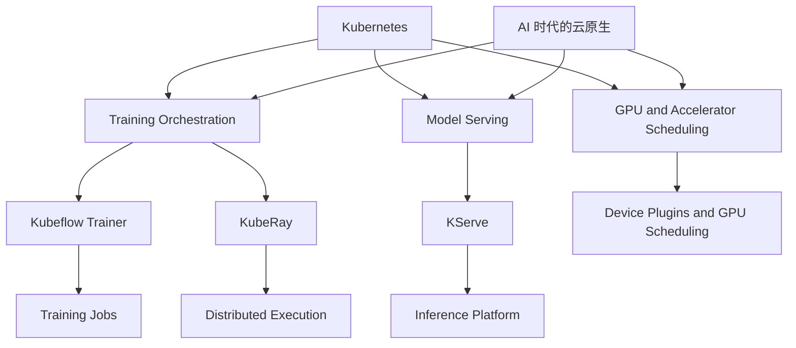

# AI 时代云原生栈图

```mermaid
flowchart TB
    A[Kubernetes] --> B[GPU and Accelerator Scheduling]
    A --> C[Training Orchestration]
    A --> D[Model Serving]
    C --> E[Kubeflow Trainer]
    C --> F[KubeRay]
    D --> G[KServe]
    B --> H[Device Plugins and GPU Scheduling]
    G --> I[Inference Platform]
    E --> J[Training Jobs]
    F --> K[Distributed Execution]
    L[AI 时代的云原生] --> B
    L --> C
    L --> D
```

## 解读

- AI 时代的云原生依然以 Kubernetes 为底座，但真正增长出来的是训练、推理和加速器治理三条扩展线
- `KServe` 代表推理平台层
- `Kubeflow Trainer` 和 `KubeRay` 代表训练与分布式执行层
- 这条地图帮助把 Cloud-Native 和 AI-Engineering 真正接起来
