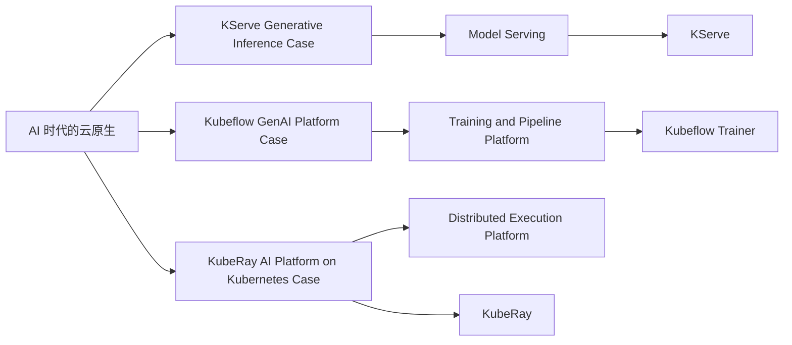

# AI 时代云原生案例图

```mermaid
flowchart LR
    A[AI 时代的云原生] --> B[KServe Generative Inference Case]
    A --> C[Kubeflow GenAI Platform Case]
    A --> D[KubeRay AI Platform on Kubernetes Case]
    B --> E[Model Serving]
    C --> F[Training and Pipeline Platform]
    D --> G[Distributed Execution Platform]
    E --> H[KServe]
    F --> I[Kubeflow Trainer]
    D --> J[KubeRay]
```

## 解读

- 这张图把 AI-era cloud-native 拆成三类代表路径：推理平台、训练平台、分布式执行平台
- 它帮助我们把“概念和项目”继续接到“平台采用形态”
- 也说明 AI 时代的云原生不是一个单点项目，而是一组互补的平台角色
