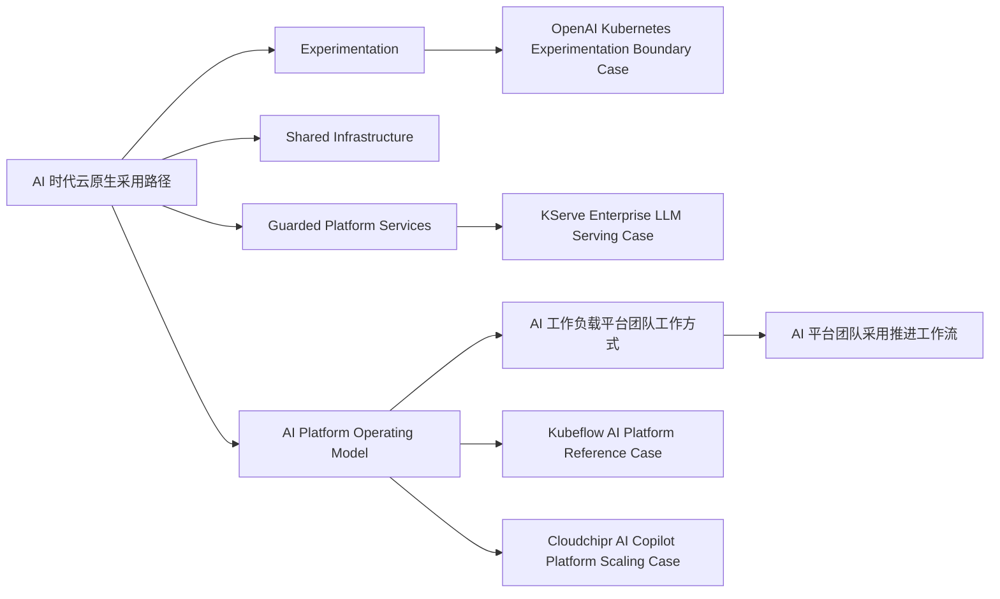

# AI 时代云原生采用图

## 解读

- adoption path 不是先把所有 AI 能力都平台化，而是从试验和 shared services 开始
- `KServe` 更像 serving 平台化阶段的代表案例
- `Kubeflow` 更像 AI platform team operating model 开始成型后的代表案例
- `OpenAI` 更像实验与平台边界如何划分的代表案例
- `Cloudchipr` 更像 AI copilot 企业平台进入治理与成本闭环的代表案例
