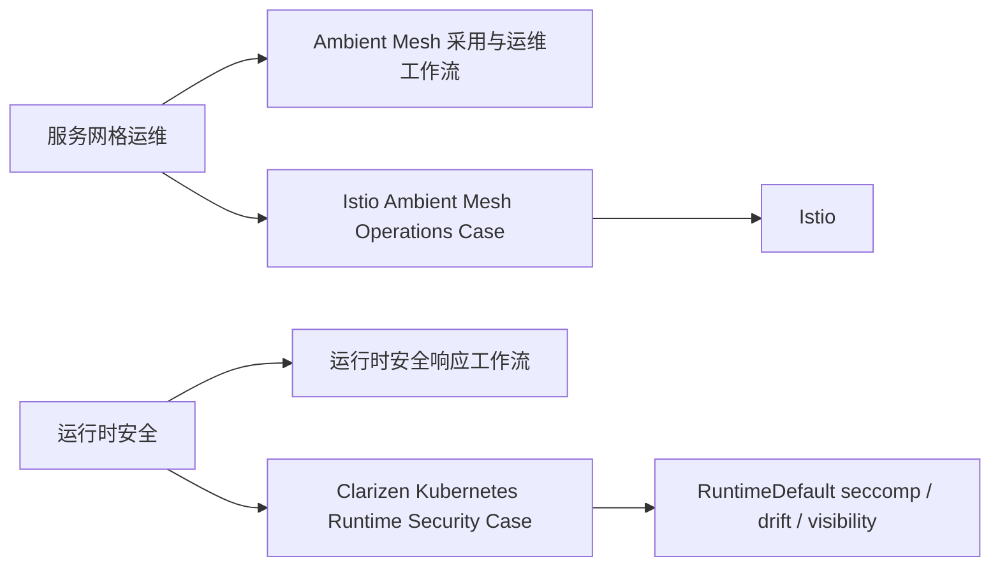

# Day-2 运维与运行时安全图

```mermaid
flowchart LR
    A["服务网格运维"] --> B["Ambient Mesh 采用与运维工作流"]
    A --> C["Istio Ambient Mesh Operations Case"]
    D["运行时安全"] --> E["运行时安全响应工作流"]
    D --> F["Clarizen Kubernetes Runtime Security Case"]
    C --> G["Istio"]
    F --> H["RuntimeDefault seccomp / drift / visibility"]
```

## 解读

- 这张图把 day-2 这层拆成两条高杠杆主线：mesh operations 与 runtime security
- 一条关注平台控制面的长期运维复杂度
- 一条关注 workload 已经运行后的默认安全和响应闭环
