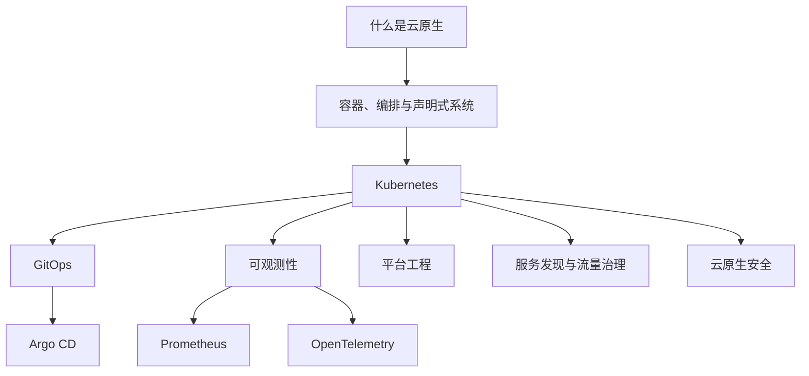

# 云原生学习路径图

```mermaid
flowchart TD
    A[什么是云原生] --> B[容器、编排与声明式系统]
    B --> C[Kubernetes]
    C --> D[GitOps]
    C --> E[可观测性]
    C --> F[平台工程]
    C --> G[服务发现与流量治理]
    C --> H[云原生安全]
    E --> I[Prometheus]
    E --> J[OpenTelemetry]
    D --> K[Argo CD]
```

## 解读

- 第一阶段先建立“云原生为什么存在”的心智模型
- 第二阶段抓住 Kubernetes 这个控制平面核心
- 第三阶段再扩到交付、观测、平台和治理
