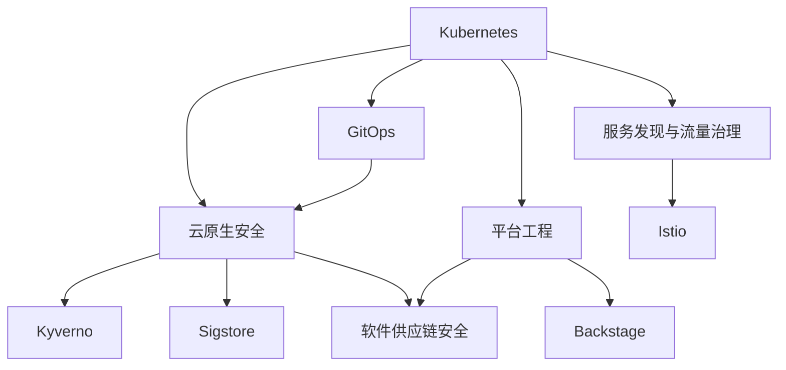

# 云原生平台与治理图

```mermaid
flowchart TD
    A[Kubernetes] --> B[GitOps]
    A --> C[服务发现与流量治理]
    A --> D[云原生安全]
    A --> E[平台工程]
    C --> F[Istio]
    D --> G[Kyverno]
    D --> H[Sigstore]
    E --> I[Backstage]
    D --> J[软件供应链安全]
    E --> J
    B --> D
```

## 解读

- `Kubernetes` 之后，最自然的第二层不是更多资源对象，而是平台与治理能力
- `Istio`、`Kyverno`、`Sigstore`、`Backstage` 分别代表 networking、policy、supply chain、developer portal 几个高频方向
- 这些方向不是孤立的，它们会共同决定平台成熟度
