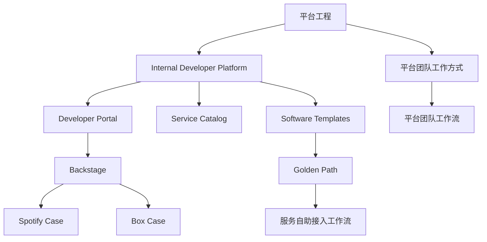

# 云原生平台实践图

```mermaid
flowchart TD
    A[平台工程] --> B[Internal Developer Platform]
    B --> C[Developer Portal]
    C --> D[Backstage]
    B --> E[Service Catalog]
    B --> F[Software Templates]
    F --> G[Golden Path]
    G --> H[服务自助接入工作流]
    A --> I[平台团队工作方式]
    I --> J[平台团队工作流]
    D --> K[Spotify Case]
    D --> L[Box Case]
```

## 解读

- 平台工程进入实践层后，重点不再只是“懂概念”，而是“开发者如何真正接入平台”
- `IDP -> portal -> catalog/templates -> golden path -> workflow` 是一条很自然的落地链路
- 案例层帮助我们看清：这些能力是如何被组织真正采用的
