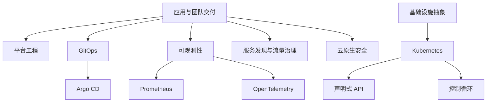

# 云原生技术栈图

```mermaid
flowchart TB
    A[应用与团队交付] --> B[平台工程]
    A --> C[GitOps]
    C --> D[Argo CD]
    A --> E[可观测性]
    E --> F[Prometheus]
    E --> G[OpenTelemetry]
    A --> H[服务发现与流量治理]
    A --> I[云原生安全]
    J[基础设施抽象] --> K[Kubernetes]
    K --> L[声明式 API]
    K --> M[控制循环]
```

## 解读

- `Kubernetes` 是基础设施抽象与控制平面的核心节点
- `GitOps`、`可观测性`、`平台工程` 是围绕它长出来的高频主题
- 技术栈图的重点不是完整列出所有 CNCF 项目，而是先看清主干
