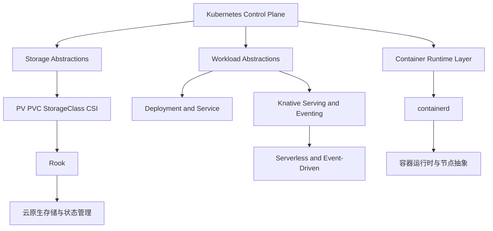

# 云原生运行时与状态图

```mermaid
flowchart TB
    A[Kubernetes Control Plane] --> B[Container Runtime Layer]
    B --> C[containerd]
    A --> D[Workload Abstractions]
    D --> E[Deployment and Service]
    D --> F[Knative Serving and Eventing]
    A --> G[Storage Abstractions]
    G --> H[PV PVC StorageClass CSI]
    H --> I[Rook]
    F --> J[Serverless and Event-Driven]
    C --> K[容器运行时与节点抽象]
    I --> L[云原生存储与状态管理]
```

## 解读

- Kubernetes 是控制平面，但真正的执行层、serverless 抽象层和存储层都各自有关键节点
- `containerd` 帮助我们看到 node 上的执行基础设施
- `Knative` 帮助我们看到 Kubernetes 之上的更高运行模型
- `Rook` 帮助我们看到状态与存储如何进入云原生平台视角
