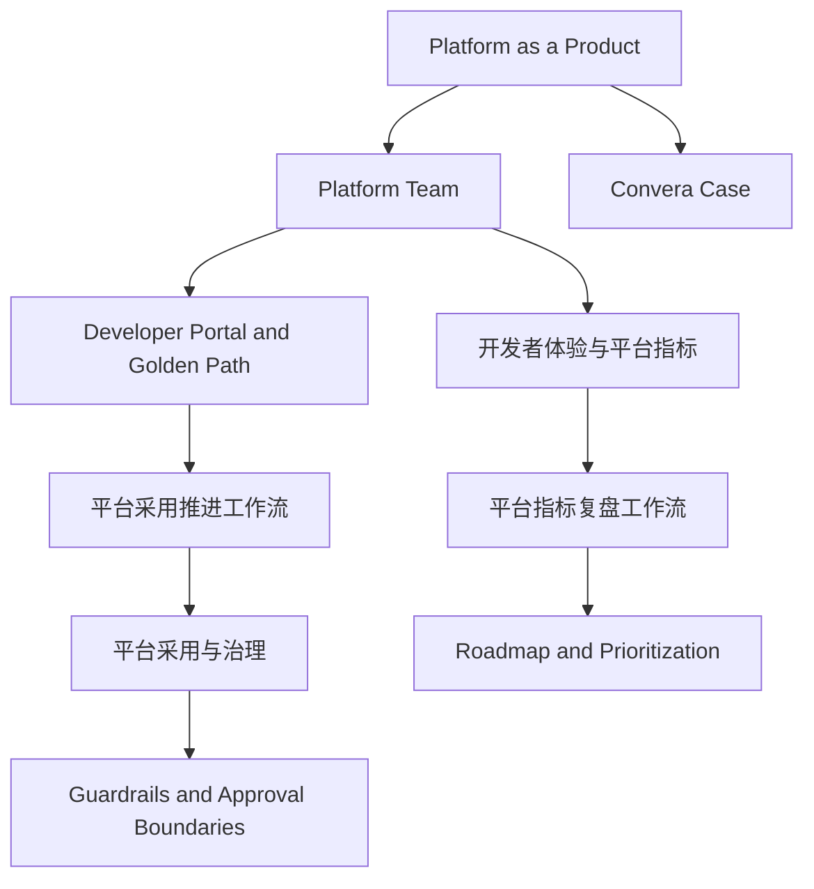

# 平台采用与度量图

```mermaid
flowchart TD
    A[Platform as a Product] --> B[Platform Team]
    B --> C[Developer Portal and Golden Path]
    C --> D[平台采用推进工作流]
    B --> E[开发者体验与平台指标]
    E --> F[平台指标复盘工作流]
    D --> G[平台采用与治理]
    G --> H[Guardrails and Approval Boundaries]
    A --> I[Convera Case]
    F --> J[Roadmap and Prioritization]
```

## 解读

- 平台产品化之后，最关键的问题会从“有没有能力”转向“有没有 adoption 和可持续运营”
- adoption 与 metrics 需要形成闭环，否则平台很难持续改进
- 平台治理不是单独的一层，而是和 golden path、workflow、review rhythm 一起工作的
