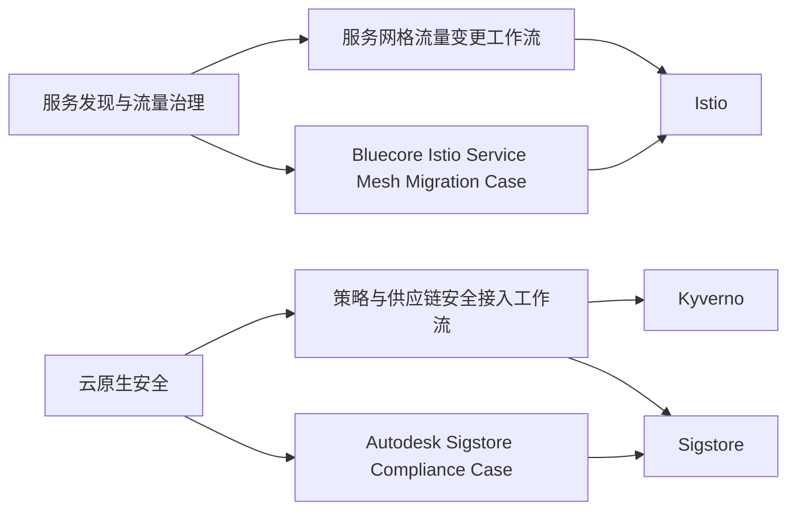

# 服务网格与安全落地图

```mermaid
flowchart LR
    A["服务发现与流量治理"] --> B["服务网格流量变更工作流"]
    A --> C["Bluecore Istio Service Mesh Migration Case"]
    D["云原生安全"] --> E["策略与供应链安全接入工作流"]
    D --> F["Autodesk Sigstore Compliance Case"]
    B --> G["Istio"]
    E --> H["Kyverno"]
    E --> I["Sigstore"]
    C --> G
    F --> I
```

## 解读

- 服务网格这条线把 `routing / retries / observability / identity` 平台化
- 安全这条线把 `policy / sign / verify / admit` 平台化
- 两条线都会把“每个团队自己实现横切能力”的模式，改造成“平台控制面默认提供能力”
