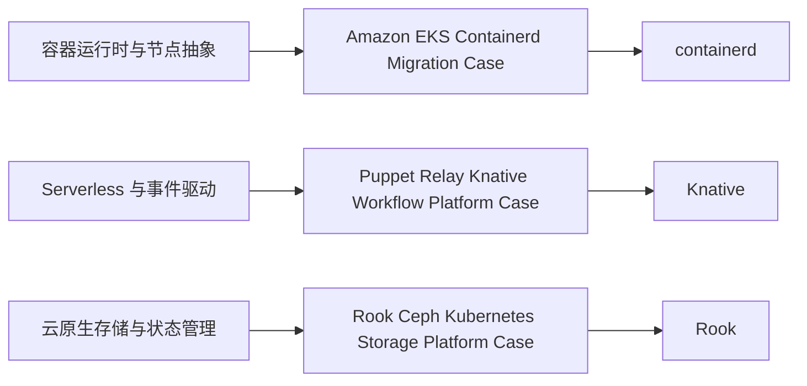

# 运行时与状态案例图

```mermaid
flowchart LR
    A["容器运行时与节点抽象"] --> B["Amazon EKS Containerd Migration Case"]
    C["Serverless 与事件驱动"] --> D["Puppet Relay Knative Workflow Platform Case"]
    E["云原生存储与状态管理"] --> F["Rook Ceph Kubernetes Storage Platform Case"]
    B --> G["containerd"]
    D --> H["Knative"]
    F --> I["Rook"]
```

## 解读

- `containerd` 代表 runtime compatibility 和 CRI 边界治理
- `Knative` 代表 event-driven runtime 与 workflow automation 平台化
- `Rook` 代表 storage operator 和 day-2 automation 的平台化
