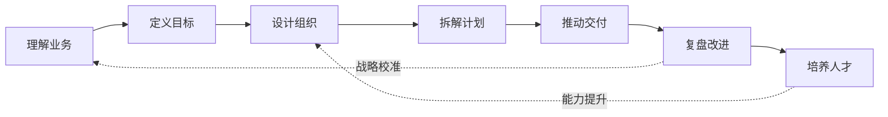

# 技术管理全景

## 核心定义

技术管理不是“管程序员”，而是围绕业务目标，设计一套让技术组织持续产出结果的系统。

它至少包含四种能力：

1. `方向判断`：知道团队应该做什么，不该做什么
2. `组织设计`：让人、团队、责任和协作关系匹配目标
3. `执行治理`：让计划、风险、交付、质量和复盘形成闭环
4. `人才发展`：让团队能力持续增长，而不是靠少数英雄硬扛

## 技术管理的工作对象

| 层 | 工作对象 | 常见误区 |
|---|---|---|
| 任务 | 需求、项目、排期、质量 | 只盯进度，不看风险和价值 |
| 人 | 招聘、绩效、成长、激励 | 只做情绪安抚，不做能力建设 |
| 团队 | 结构、边界、协作、文化 | 只画组织架构，不改信息流 |
| 系统 | 架构、平台、流程、工具 | 只追新技术，不看业务复利 |
| 业务 | 增长、成本、体验、风险 | 技术语言无法翻译成业务判断 |

## 管理者的五个视角

### 1. 业务视角

问：

- 当前业务阶段是什么？
- 技术团队的最大杠杆在哪里？
- 什么指标真正决定业务成功？

### 2. 组织视角

问：

- 责任边界清不清楚？
- 信息流是否顺畅？
- 关键岗位是否有备份？

### 3. 工程视角

问：

- 交付速度是否健康？
- 质量、稳定性、安全和技术债是否可控？
- 平台化和自动化是否在产生复利？

### 4. 人才视角

问：

- 团队里谁能独立负责结果？
- 谁需要培养，谁需要转岗，谁需要淘汰？
- 是否有下一层管理者和技术骨干？

### 5. 经营视角

问：

- 人力、云成本、外采、工具、机会成本是否匹配收益？
- 技术投入是成本中心，还是增长、效率、风控和壁垒的一部分？

## 一条管理闭环

## 衡量技术管理是否有效

不是看管理者忙不忙，而是看：

- 业务目标是否更稳定地达成
- 团队是否减少对单点英雄的依赖
- 项目风险是否更早暴露
- 工程质量是否越来越可控
- 人才是否在成长和分层
- 跨部门协作是否越来越低摩擦
- 技术投入是否能解释清楚业务收益

## 推荐继续

1. [[角色与职责：Tech Lead、经理、总监、CTO]]
2. [[组织设计、人才密度与梯队建设]]
3. [[目标、计划与交付治理]]
4. [[绩效、反馈与人才发展]]
5. [[技术战略、架构治理与平台化]]

