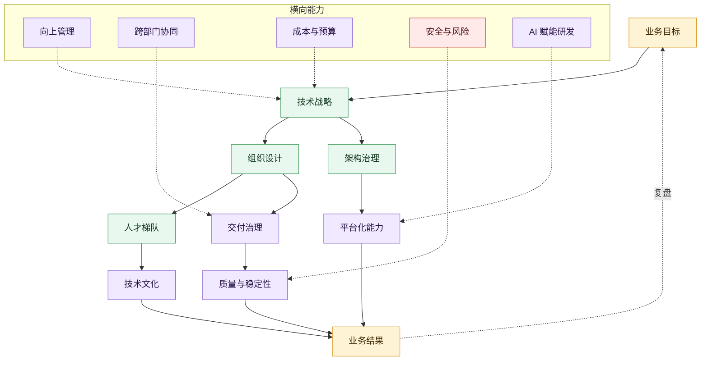

# 技术管理全景图

这张图回答一个问题：技术管理者如何把业务目标转成组织技术产能。

## 图的读法

- 主线是 `业务目标 -> 技术战略 -> 组织与交付 -> 业务结果`
- 中间层是技术管理者真正要设计的系统：组织、人才、交付、架构、平台、质量、文化
- 横向能力是管理者越往上越绕不开的接口：向上管理、跨部门协同、成本、安全、AI 赋能

## 继续阅读

- [[../05-Topics/技术管理全景|技术管理全景]]
- [[../管理问题导航|管理问题导航]]
- [[技术管理角色成长地图]]

