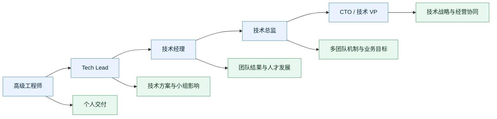

# 技术管理角色成长地图

## 成长关键

- 从高级工程师到 Tech Lead：从个人最优，变成小组技术最优
- 从 Tech Lead 到经理：从方案负责，变成团队结果负责
- 从经理到总监：从管一个团队，变成建多团队机制
- 从总监到 CTO / VP：从技术组织，变成技术战略和经营协同

## 继续阅读

- [[../05-Topics/角色与职责：Tech Lead、经理、总监、CTO|角色与职责：Tech Lead、经理、总监、CTO]]
- [[../10-Role-Paths/从技术经理到CTO的成长路径|从技术经理到 CTO 的成长路径]]

