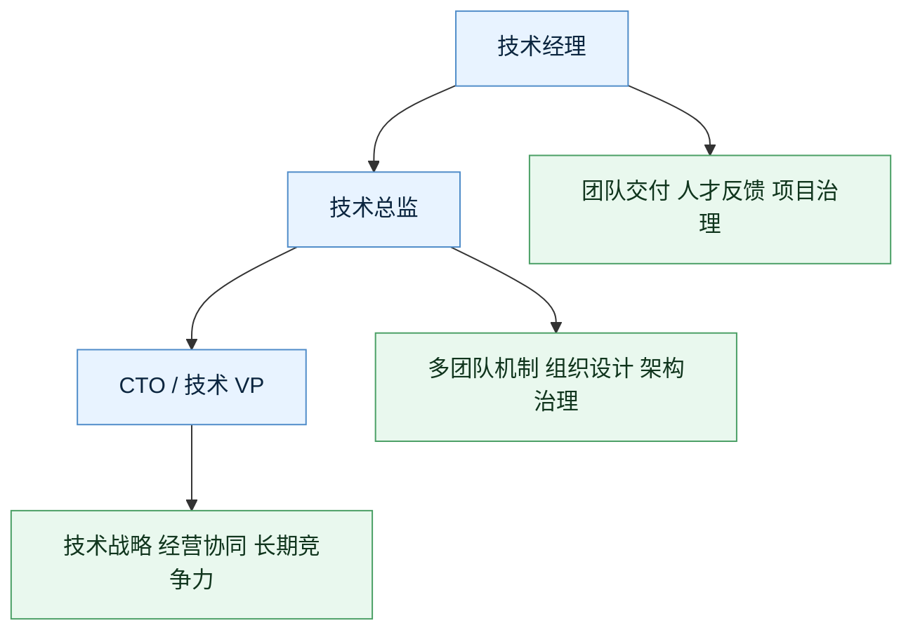

# 从技术经理到 CTO 的成长路径

## 总体路线

## 第一阶段：技术经理

核心目标：让一个团队稳定产出。

你要建立：

- 目标拆解能力
- 项目推进能力
- 1-on-1 和反馈能力
- 人才识别和培养能力
- 风险暴露和复盘能力

验收标准：

- 团队不靠你天天救火也能交付
- 成员知道目标和期望
- 项目风险能提前暴露
- 团队里开始出现新的 owner

## 第二阶段：技术总监

核心目标：让多个团队通过机制协同。

你要建立：

- 多团队目标对齐
- 组织结构设计
- 技术治理机制
- 平台化判断
- 中层管理者培养
- 跨部门资源协调

验收标准：

- 多团队之间责任边界清晰
- 关键方向有 owner 和 backup
- 架构和质量问题有治理机制
- 你培养出可靠的 manager / tech lead

## 第三阶段：CTO / 技术 VP

核心目标：让技术成为公司竞争力。

你要建立：

- 技术战略
- 经营意识
- 组织设计能力
- 预算和成本能力
- 技术品牌和招聘能力
- 风险、安全、合规和稳定性底线
- AI、数据、平台等长期能力布局

验收标准：

- 技术路线能支撑公司战略
- 组织能力能跟上业务阶段
- 成本、速度、质量、风险之间能做清晰取舍
- 公司高层把技术视为战略能力，而不是纯成本中心

## 常见卡点

### 卡在经理层

- 太喜欢亲自解决问题
- 不会授权
- 不敢做负反馈
- 不会培养下一级 owner

### 卡在总监层

- 只会协调，不会建机制
- 对业务理解不够
- 不会做组织设计
- 技术战略停留在技术栈选择

### 卡在 CTO / VP 层

- 脱离一线真实问题
- 技术语言无法转成经营语言
- 组织设计能力不足
- 忽视成本、安全、合规和人才密度

## 推荐继续

- [[../05-Topics/角色与职责：Tech Lead、经理、总监、CTO|角色与职责：Tech Lead、经理、总监、CTO]]
- [[../05-Topics/组织设计、人才密度与梯队建设|组织设计、人才密度与梯队建设]]
- [[../05-Topics/技术战略、架构治理与平台化|技术战略、架构治理与平台化]]

