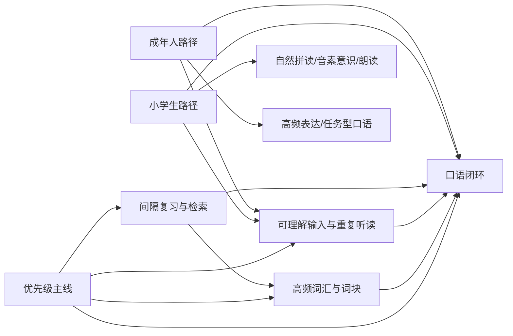

# 英语学习系统图

```mermaid
flowchart LR
  P["优先级主线"] --> V["高频词汇与词块"]
  P --> I["可理解输入与重复听读"]
  P --> S["口语闭环"]
  P --> R["间隔复习与检索"]

  V --> S
  I --> S
  R --> V
  R --> S

  C["小学生路径"] --> PH["自然拼读/音素意识/朗读"]
  C --> I
  C --> S

  A["成年人路径"] --> CH["高频表达/任务型口语"]
  A --> I
  A --> S
```

## 解释

- 主干不是单点，而是 `词汇 -> 输入 -> 输出 -> 复习` 的闭环
- 小学生和成年人共享闭环，但切入方式不同
