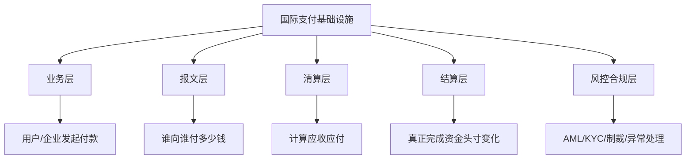

# 什么是国际支付基础设施

## 这个主题是什么

国际支付基础设施，指的是一套让跨国家、跨银行、跨币种资金能够被安全传递、清算、结算和对账的制度与技术网络。

## 关键术语

- `International Payment Infrastructure`：国际支付基础设施
- `Messaging`：报文传递
- `Clearing`：清算
- `Settlement`：结算
- `Correspondent Banking`：代理行体系

## 为什么重要

- 大多数人只看到“钱从 A 到了 B”，但实际背后经过的是多层机构协作
- 如果不先建立整体框架，后面学 `SWIFT`、清算、汇兑、合规时会混在一起
- 即使你做的是支付业务侧，也需要知道哪些问题是业务机制，哪些问题其实来自底层网络和账户关系

## 你先要抓住什么

- 国际支付不是一个单一网络，而是多层系统叠在一起
- 信息传递和资金最终移动，不一定发生在同一个网络里
- 参与者包括付款人、收款人、付款行、收款行、中间行、清算机构、结算系统和合规检查节点
- 跨境支付更慢、更贵、更复杂，往往不是因为“系统差”，而是因为参与方更多、规则更多、风险更高

## 用一句话先建立直觉

国际支付可以理解为“很多机构共同参与的一条跨境资金协作链”，而不是一条单独的支付通道。

## 可以粗分成哪几层

## 学习时最该问的问题

- 这一步是在传递信息，还是在转移价值
- 哪些机构只是传消息，哪些机构实际持有账户和资金
- 为什么跨境支付通常更慢、更贵、更复杂
- 业务团队当前遇到的问题，究竟发生在业务层、网络层还是账户层

## 先不要混淆的两件事

- 报文到了，不等于钱已经最终到账
- 账上显示处理中，不代表结算已经完成

## 业务案例

### 案例 1：用户问“为什么这笔跨境付款这么慢”

场景：从业务视角看，用户只看到一笔付款迟迟没有到账。

但从基础设施视角看，原因可能很多：

- 报文已经到达，但资金还没最终结算
- 中间行或代理行还在处理
- 合规审查触发了额外检查
- 不同币种和时区带来了额外等待

这说明业务上的很多“慢”和“贵”，本质上并不是前台产品问题。

### 案例 2：业务想压低成本，但忽略了底层网络差异

场景：团队只按费率选支付路径，后来发现某些跨境路径虽然便宜，但到账慢、对账差、异常处理复杂。

这说明如果不理解基础设施层，就很容易把短期成本最优误判成长期经营最优。

## 一个检查清单

- 是否分清报文、清算、结算三个不同概念
- 是否知道代理行 / 中间行为什么会出现
- 是否能判断问题发生在业务机制还是底层网络
- 是否理解跨境支付慢、贵、复杂背后的结构原因

## 相关

- [[清算与结算]]
- [[SWIFT 与代理行体系]]
- [[跨境支付中的汇兑]]
- [[支付链路总览]]
