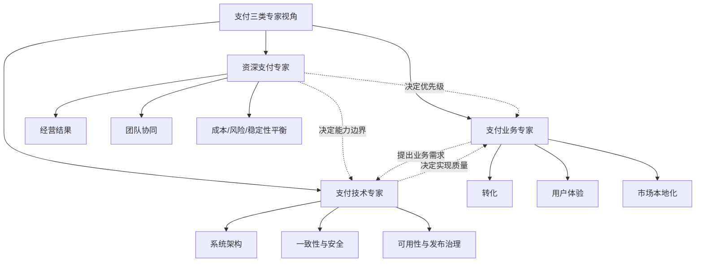

# 支付三类专家视角

## 这页解决什么问题

同样是学支付，`资深支付专家`、`支付业务专家`、`支付技术专家` 的关注点并不完全一样。这页的作用，就是把三种视角拆开，你以后无论是补知识还是带团队，都知道自己缺的是哪一层。

## 一句话先建立直觉

- `资深支付专家`：看整体经营系统
- `支付业务专家`：看增长、转化、用户体验和商业结果
- `支付技术专家`：看系统架构、状态一致性、安全与稳定性

## 1. 资深支付专家视角

### 这类人最关心什么

- 成功率、拒付率、资损率、成本、稳定性是否一起变好
- 团队是否能围绕统一指标协同
- 支付是否从“工具”变成“经营能力”

### 必须掌握的核心主题

- [[资深支付专家能力体系]]
- [[支付链路总览]]
- [[支付核心指标体系]]
- [[支付负责人常看报表与指标看板]]
- [[拒付与资损治理框架]]
- [[支付团队能力地图]]
- [[支付费率、成本与单位经济]]

## 2. 支付业务专家视角

### 这类人最关心什么

- 用户为什么付不出来
- 哪些支付方式最值得接
- 哪些市场要做本地化
- 收银台、订阅、退款和客服流程如何影响转化与留存

### 必须掌握的核心主题

- [[支付成功率优化]]
- [[收银台设计与支付体验优化]]
- [[支付方式策略与市场本地化]]
- [[订阅支付与自动续费治理]]
- [[3DS 与认证策略]]
- [[拒付、争议与抗辩]]
- [[跨境电商支付]]

## 3. 支付技术专家视角

### 这类人最关心什么

- 系统怎么拆服务
- 交易状态怎么定义
- 幂等、异步通知、Webhook、对账如何保证一致性
- 怎么处理敏感数据、安全合规和上线风险

### 必须掌握的核心主题

- [[支付系统架构与核心服务]]
- [[支付账本、交易状态机与幂等设计]]
- [[Webhook、异步通知与一致性]]
- [[PCI DSS、Tokenization 与敏感数据安全]]
- [[支付测试、沙箱与发布治理]]
- [[支付监控与告警]]
- [[支付异常排查与事故复盘]]

## 这三类视角怎么互相配合

## 你该怎么用这页

- 如果你想成为“懂全局的人”，按 `资深支付专家` 主线读
- 如果你最关心业务增长和支付表现，按 `支付业务专家` 主线读
- 如果你以后会和支付系统、网关、账本、回调打交道，按 `支付技术专家` 主线读
- 最理想的状态，是三条线都懂，但先有一条主线最稳

## 最关键的一句话

支付专家的成长，不是把同一套知识背三遍，而是学会从经营、业务和技术三个坐标系看同一件事。

## 关联

- [[资深支付专家能力体系]]
- [[支付专家能力总览图]]
- [[支付链路总览]]
