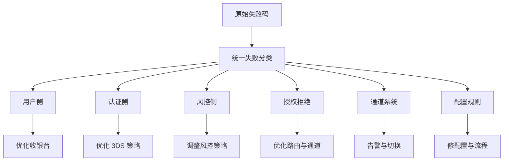

# 支付失败码与原因分类

## 这页解决什么问题

成功率优化最怕的一种情况，就是团队只知道“失败变多了”，但不知道失败到底是用户放弃、3DS 失败、发卡行拒绝、通道异常，还是风控误杀。这页就是把“失败”拆成可行动的原因树。

## 为什么这页特别重要

支付失败码不是给技术看着玩的，它是支付运营、风控、路由、产品、客服共同使用的一套问题归因语言。

## 一条最实用的原则

不要直接按原始返回码做经营判断，而是先把原始码映射成统一的业务分类。

## 建议的一级分类

### 1. 用户侧失败

- 卡号、有效期、CVV、账单地址填写错误
- 余额不足
- 用户主动取消
- OTP / challenge 未完成

这类问题通常优先从收银台体验、用户引导、支付提示文案去优化。

### 2. 认证侧失败

- 3DS challenge 失败
- challenge 超时
- 发卡行 ACS 页面异常
- 豁免失败后回退认证失败

这类问题要结合 [[3DS 与认证策略]] 看，不宜简单粗暴地全量强认证。

### 3. 风控侧失败

- 风险规则拦截
- 模型判高风险
- 黑名单 / 设备风险 / IP 风险触发
- 账户异常或交易行为异常

这类问题要同时看误杀率，不能只看拦截量。

### 4. 授权拒绝类失败

- 发卡行拒绝
- 限额或额度问题
- 卡状态异常
- 不支持跨境 / 不支持该 MCC / 不支持该币种

这类失败经常被误判成“通道不行”，实际上很多问题发生在发卡行侧。

### 5. 通道与系统类失败

- PSP 超时
- 收单连接失败
- 网关报错
- 幂等异常
- 下游服务故障

这类失败需要快速告警、重试和 failover 能力。

### 6. 配置与业务规则类失败

- 路由配置错误
- 商户号不可用
- 币种 / 国家 / 卡种未开通
- 风险策略或限额配置错误

这类问题往往不是“支付网络本身”的问题，而是内部运营和配置治理的问题。

## 一个推荐的映射结构

## 真正要落地的数据结构

每一笔失败交易，最好至少打上这些标签：

- 原始返回码
- 标准化失败分类
- 失败阶段
- 是否可重试
- 是否建议用户重试
- 是否需要切换通道
- 是否需要人工复核

## 可恢复失败和不可恢复失败

### 可恢复失败

- 短时网络抖动
- PSP 超时
- 某收单节点异常
- 个别临时系统错误

这类可以考虑有限次重试或切路由。

### 不可恢复失败

- CVV 错误
- 卡已失效
- 发卡行明确拒绝
- 风控明确拦截

这类继续重试通常只会增加成本和风险。

## 为什么要做“失败阶段”标记

同样叫失败，动作完全不同：

- 发起前失败：看收银台
- 认证中失败：看 3DS
- 授权时失败：看发卡行和通道
- 成功后异常：看清结算、退款、补单和对账

## 业务案例

### 案例 1：运营说“失败全是银行问题”

场景：团队看到失败交易很多，就把它们统一归成“银行拒绝”。

但一做标准化分类后发现：

- 25% 是用户填写错误
- 18% 是 3DS challenge 未完成
- 12% 是内部风控误杀
- 真正的发卡行拒绝只有 30% 多一点

这意味着原本打算去找收单投诉，其实应该先修收银台、优化认证和风控策略。

### 案例 2：某 PSP 返回码看起来一样，实际原因完全不同

场景：某 PSP 把很多失败都打成通用错误码。

成熟团队会自己做二次映射：

- 结合失败发生阶段
- 结合上下游日志和 3DS 结果
- 结合 BIN、通道、国家信息
- 结合是否可重试和重试结果

这样才能把一个“黑盒返回码”转成真正能运营的归因体系。

## 常见误区

- 直接拿 PSP 返回码做所有分析
- 不区分可重试与不可恢复
- 不区分用户侧失败和发卡行拒绝
- 看不到失败发生在哪个阶段

## 最关键的一句话

如果你没有统一失败码分类体系，你就无法真正系统性地提升成功率。

## 关联

- [[支付核心指标体系]]
- [[支付成功率优化框架]]
- [[授权链路与发卡行拒绝机制]]
- [[支付监控与告警]]
- [[支付负责人常看报表与指标看板]]
