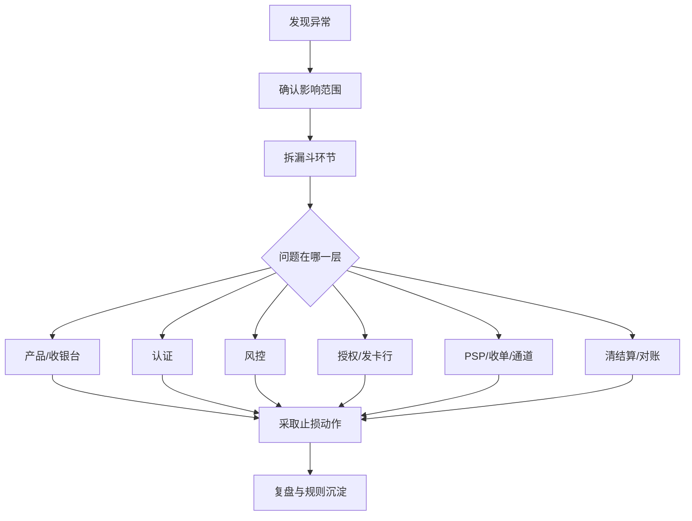

# 支付异常排查与事故复盘

## 这页解决什么问题

资深支付专家一定会遇到这样的场景：某个国家成功率突然掉 5%，某个 PSP 大量超时，某类卡拒付突然升高，或者 3DS challenge 异常飙升。这时候真正关键的不是“谁最懂术语”，而是谁能最快把问题拆开、定位、止损、复盘。

## 一套标准排查顺序

### 1. 先判断影响范围

先回答：

- 是全量问题还是局部问题
- 是某个国家 / 币种 / 卡种 / BIN / 通道的问题
- 是支付发起变少、认证通过率变差、授权率下降，还是成功后处理异常

### 2. 再判断问题发生在哪一层

- 产品和收银台
- 认证层
- 风控层
- 授权层
- 通道层
- 清结算和后处理层

### 3. 再决定止损动作

- 切换通道
- 调低或调高某些风控阈值
- 降低 challenge 比例
- 暂停高风险流量
- 启用人工审核
- 修复配置或回滚发布

## 推荐的排查图

## 事故里最常见的止损动作

### 通道相关

- 降权
- 切流
- failover
- 暂停某些路由策略

### 认证相关

- 调整 3DS 强度
- 关闭异常 challenge 规则
- 临时切换认证服务

### 风控相关

- 回滚误杀规则
- 提升人工审核比例
- 对局部高风险流量加强限制

### 配置相关

- 回滚商户号配置
- 修复币种 / MCC / 国家配置错误
- 修复幂等、重试、限额设置

## 业务案例

### 案例 1：周五晚上某个国家成功率突然掉 7%

场景：业务方先怀疑市场变化，但值班同学按标准流程拆后发现：

- 发起率正常
- 认证通过率正常
- 授权率在某 PSP 上单独下滑
- 同时超时率上升

于是团队先切换备用通道止损，再和 PSP 排查。这里专业度体现在“先止损，再根因”，而不是大家围着群里猜。

### 案例 2：拒付率两个月后异常抬升

场景：短期看成功率和收入都不错，但两个月后某产品线拒付率明显上升。

复盘后发现：

- 之前为了提成功率放宽了部分认证和风控
- 账单描述没有同步优化
- 续费提醒也没跟上

这说明支付事故不只有实时宕机，也包括“经营决策带来的滞后性事故”。

## 复盘要回答的 5 个问题

1. 最早的异常信号是什么
2. 为什么没有更早发现
3. 为什么影响会扩大
4. 临时止损动作是否有效
5. 后续如何避免再次发生

## 复盘输出应该沉淀什么

- 时间线
- 影响范围
- 关键指标变化
- 根因分类
- 止损动作
- 永久修复项
- 监控和告警改进项
- owner 与截止时间

## 为什么复盘不是技术团队的独角戏

因为支付异常经常横跨：

- 产品体验
- 通道稳定性
- 风控策略
- 认证策略
- 运营配置
- 财务与对账

如果只让技术团队复盘，很多真正的经营问题会被漏掉。

## 常见误区

- 一出问题先怪 PSP
- 只修眼前问题，不补监控和分类
- 复盘没有 owner 和时间点
- 没有把事故经验沉淀到路由、风控、认证策略中

## 最关键的一句话

支付团队的成熟度，很大程度上体现在“同样的问题第二次还会不会再发生”。

## 关联

- [[支付核心指标体系]]
- [[支付监控与告警]]
- [[支付失败码与原因分类]]
- [[支付团队能力地图]]
- [[支付负责人常看报表与指标看板]]
