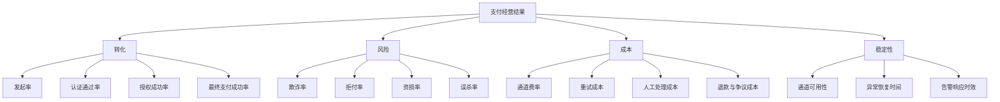

# 支付核心指标体系

## 这页解决什么问题

如果我们要把支付当成一门经营能力来做，第一步不是马上调通道，而是先知道应该看哪些指标、这些指标之间是什么关系，以及出现异常时先看哪里。

## 先抓住一个原则

支付指标不是单个数字，而是一套从收入到损失、从前台转化到后台运营的指标系统。

一个成熟的支付团队，至少要同时盯住四类指标：

1. 转化指标
2. 风险指标
3. 成本指标
4. 稳定性指标

## 一张经营总图

## 1. 转化指标

### 发起率

用户走到收银台后，最终愿不愿意点“支付”，这通常反映收银台体验、价格信任度、支付方式覆盖度。

### 认证通过率

用户进入 `3DS` 或其他认证流程后，最终有没有完成认证。这个指标会受认证策略、challenge 体验、银行页面兼容性影响。

### 授权成功率

已经提交给通道和发卡行的交易，有多少拿到了授权通过。这通常是支付专业度的核心指标之一。

### 最终支付成功率

用户发起到最终成功的总结果。它最重要，但不能只看它。

## 2. 风险指标

### 欺诈率

通常看欺诈订单数或金额占比，用于衡量盗刷、羊毛党、账户接管等问题。

### 拒付率

拒付是卡类支付中最关键的后验风险指标之一。它往往滞后于支付成功率，所以不能只看短期收入。

### 资损率

衡量真实损失金额占交易金额比例，通常包含欺诈、拒付、运营错误等多种来源。

### 误杀率

风控把本来应该放行的好交易挡掉了多少。很多团队只看拦截量，不看误杀，这是典型误区。

## 3. 成本指标

### 通道费率

包括 `MDR`、跨境附加费、汇兑成本、3DS 成本、拒付处理成本等。

### 重试成本

无效重试会增加通道成本、触发更多拒绝、甚至恶化风险表现。

### 人工处理成本

例如人工审核、争议处理、拒付抗辩、客服沟通等。

### 退款与争议成本

包括退款手续费、订单损失、履约成本和拒付后续处理成本。

## 4. 稳定性指标

### 通道可用性

通道、PSP、风控、认证系统是否稳定可用，异常时是否能及时切换。

### 异常恢复时间

也就是从问题发生到恢复正常用了多久。资深团队会盯 `MTTR`，不只是盯事故次数。

### 告警响应时效

告警发出后，多快有人发现、多快有人定位、多快有人处置。

## 应该怎么拆维度

支付指标一定要能按以下维度切：

- 国家 / 地区
- 币种
- 支付方式
- 卡品牌与卡种
- BIN
- 终端设备
- 通道 / PSP / 收单行
- 商户 / 产品线
- 新老用户
- 首付 / 续费

如果不能切这些维度，就很难做经营动作。

## 常见分析顺序

1. 先看总成功率、总拒付率、总资损率是否异常
2. 再按国家、支付方式、通道拆分
3. 然后看是用户侧、认证侧、授权侧还是后处理侧的问题
4. 最后决定是改风控、改认证、换路由、调通道，还是修产品体验

## 业务案例

### 案例 1：东南亚市场成功率突然下降

场景：某个东南亚国家总成功率一周内从 78% 掉到 70%，团队第一反应是“通道坏了”。

更专业的拆法是：

1. 先看发起率有没有下降，如果没掉，说明用户还愿意付
2. 再看认证通过率，如果显著下降，优先排查 `3DS` 或银行 challenge 页面
3. 如果认证正常但授权率下降，再按 BIN、发卡国、卡品牌拆授权表现
4. 如果只在单一 PSP 上掉得厉害，再考虑切流或 failover

这里真正体现专家能力的地方，是不会只看总成功率，而是能迅速把问题拆到具体漏斗。

### 案例 2：成功率上去了，但老板发现利润没变好

场景：团队把重试策略放宽后，总成功率提高了 2 个点，但拒付和通道成本也上升了。

这时要一起看：

- 新增成功交易里有多少来自高风险用户
- 通道费和 3DS 成本多了多少
- 拒付率和资损率有没有滞后上升
- 实际净收入是否真的提升

这也是为什么资深支付专家不会把“成功率最大化”当成唯一目标，而是看 `成功率 + 风险 + 成本 + 稳定性` 的综合结果。

## 常见误区

- 只盯总成功率，不看漏斗
- 只盯放行率，不看后续拒付和资损
- 只盯通道费率，不看真实净收益
- 把稳定性问题误判成发卡行拒绝问题

## 你真正要建立的能力

看到一个指标波动时，能立刻把它映射到具体链路，并知道下一步去看哪几组数据。这才是支付专家和普通运营之间的分水岭。

## 关联

- [[资深支付专家能力体系]]
- [[支付成功率优化框架]]
- [[支付失败码与原因分类]]
- [[支付监控与告警]]
- [[支付负责人常看报表与指标看板]]
