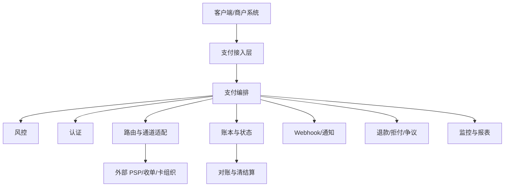

# 支付系统架构与核心服务

## 这页解决什么问题

如果你要从技术角度把支付做稳，首先要知道一套支付系统通常由哪些核心服务组成，以及这些服务为什么不能全都揉在一个接口里。

## 支付系统常见核心服务

- 收银台 / API 接入层
- 支付编排服务
- 风控服务
- 认证服务
- 路由与通道适配层
- 账本与状态服务
- Webhook / 通知服务
- 对账与清结算服务
- 退款 / 拒付 / 争议服务
- 报表与监控服务

## 一张技术架构直觉图

## 为什么不能一锅炖

因为支付天然有这些复杂度：

- 外部依赖多
- 同步与异步混合
- 状态会变化
- 对一致性和可追踪性要求高
- 安全与合规约束强

## 业务案例

### 案例 1：所有逻辑写在一个支付接口里，后面很难扩展

场景：早期只有一个 PSP，团队把路由、风控、回调、状态更新全写在一个服务里。后来接第二家 PSP 时，几乎每次改动都会牵一发而动全身。

### 案例 2：没有单独的编排层，导致业务很难做动态策略

场景：风控、3DS、路由都直接绑在通道调用里，导致后面很难实现动态认证、灰度切流、受控重试。

## 一个检查清单

- 是否有独立的支付编排层
- 是否能独立调整风控、认证、路由策略
- 是否有统一状态服务而不是每个通道各记各的
- 是否把通知、对账、退款和争议视为系统一部分
- 是否能快速接入第二家、第三家通道而不重写核心逻辑

## 常见误区

- 只看“能调通”不看后续可扩展性
- 把账本和支付状态混在一起
- 把异步通知逻辑塞进同步链路
- 忽视退款、争议、对账这些后链路服务

## 最关键的一句话

支付系统真正的复杂度，不在“发起一次扣款”，而在“如何让整个生命周期都可控、可追踪、可扩展”。

## 关联

- [[支付账本、交易状态机与幂等设计]]
- [[Webhook、异步通知与一致性]]
- [[支付测试、沙箱与发布治理]]
- [[支付技术架构图]]
