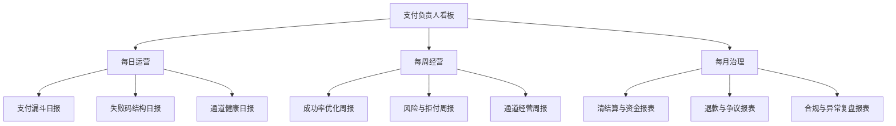

# 支付负责人常看报表与指标看板

## 这页解决什么问题

如果你是支付负责人，真正有用的不是“知道很多概念”，而是每天、每周、每月应该看哪些报表，分别用来发现什么问题，以及看到异常后第一步该找谁、看什么。

## 一句话原则

报表不是为了汇报，而是为了更快发现问题、判断优先级、做经营取舍。

## 每日看板

### 1. 支付漏斗日报

核心看：

- 发起率
- 认证通过率
- 授权成功率
- 最终支付成功率
- 分国家 / 币种 / 支付方式 / 通道表现

适合回答：今天哪里先坏了。

### 2. 失败码结构日报

核心看：

- 用户侧失败占比
- 认证失败占比
- 授权拒绝占比
- 通道超时和系统故障占比
- 可重试失败占比

适合回答：今天的问题主要该由产品、风控、通道还是工程先接。

### 3. 通道健康日报

核心看：

- 各 PSP / 收单成功率
- 超时率
- 故障时长
- failover 触发次数
- 通道工单状态

适合回答：是不是要切流、降权或升级处理。

## 每周经营报表

### 1. 成功率优化周报

重点不是看绝对数字，而是看：

- 哪些市场在改善
- 哪些市场在恶化
- 最近做的优化动作是否带来正向结果
- 成功率提升是否伴随拒付或资损变化

### 2. 风险与拒付周报

核心看：

- 欺诈率
- 拒付率
- 资损率
- 误杀率
- 高风险国家 / BIN / 商户 / 产品线

适合回答：风控是太松还是太紧。

### 3. 通道经营周报

核心看：

- 通道净成功率
- 综合费率
- 拒付表现
- 结算周期
- 对账差异
- 合作响应效率

适合回答：哪些通道值得放量，哪些该降权或淘汰。

## 每月治理报表

### 1. 清结算与资金报表

核心看：

- 结算净额
- 手续费结构
- 汇兑损益
- 对账差异金额
- 长账龄未闭环 case

### 2. 退款与争议报表

核心看：

- 退款率
- 争议率
- 拒付率
- 抗辩成功率
- 高发原因码与高发产品线

### 3. 合规与异常复盘报表

核心看：

- 冻结资金金额
- 商户 / 用户补件情况
- 高风险地区策略变化
- 月度重大事故和复盘完成率

## 一个支付负责人该有的报表视角

## 业务案例

### 案例 1：团队每天都很忙，但不知道先救哪一块

如果没有固定日报，团队会在群里被动响应问题。

一旦有了支付漏斗日报和失败码结构日报，很多问题能在 10 分钟内先定性：

- 是收银台问题
- 是 3DS 问题
- 是发卡行拒绝
- 是某个通道故障

### 案例 2：老板觉得成功率提高了，为什么收入没明显增长

这时候就不能只看成功率日报，而要联动：

- 风险与拒付周报
- 通道经营周报
- 清结算与资金报表

真正成熟的支付负责人，看的不是单份报表，而是报表之间的因果关系。

## 推荐搭配阅读

- [[支付核心指标体系]]
- [[支付成功率优化框架]]
- [[收单行、PSP 与通道管理]]
- [[支付异常排查与事故复盘]]
