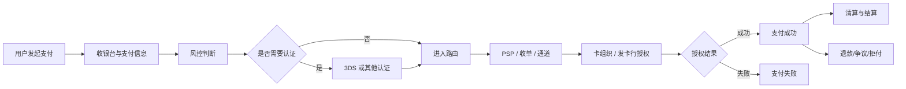

# 支付链路总览

## 这页解决什么问题

这页不是讲底层结算网络，而是帮助你建立一个业务视角：一笔支付从用户点击支付，到最终成功、失败、退款、拒付或结算入账，中间到底经过了哪些环节。

## 一条典型业务链路

## 你先要抓住什么

- 支付成功率不是单一问题，它受认证、风控、路由、发卡行响应、用户填写质量等共同影响
- 一笔支付“失败”也不是单一原因，可能是风控拦截、认证失败、通道故障、发卡行拒绝、限额问题等
- 做支付业务，最重要的是把链路拆开，每个环节分别优化
- 一笔交易“前台成功”也不代表事情结束，后面还会进入清算、结算、退款和拒付治理

## 从业务角度看这条链路

### 用户看到的

- 收银台是否顺畅
- 是否要做额外认证
- 支付结果是否清晰
- 失败后是否有合理引导

### 支付团队看到的

- 哪一环掉转化
- 哪一环在放大风险
- 哪一环让成本变高
- 哪一环让后续拒付和售后问题变多

### 财务和运营看到的

- 钱是否真的到账
- 退款、拒付、对账是否闭环
- 成功率提高后净收益是否真的提升

## 核心指标

- 支付发起率
- 认证通过率
- 授权成功率
- 风控拦截率
- 误杀率
- 拒付率
- 最终支付成功率
- 结算净额

## 链路里最容易被忽略的断点

- 收银台填写错误或跳失
- `3DS challenge` 体验差
- 风控误杀
- 授权拒绝被误判成“通道问题”
- 通道技术超时
- 成功后退款 / 拒付 / 对账流程不闭环

## 业务案例

### 案例 1：团队一直盯授权率，结果真正问题在认证前

场景：某市场成功率持续偏低，团队最先怀疑收单和发卡行。但拆链路后发现，真正掉得厉害的是认证通过率，用户在 challenge 页面大量流失。

这说明如果没有完整链路视角，团队很容易在错误的环节上花大量时间。

### 案例 2：前台支付成功了，但后面持续出资金和投诉问题

场景：支付看板上的成功率很好看，但后面退款回写慢、重复扣款、对账差异和拒付都在增多。

这说明支付链路不能只看到“扣款成功”，而要把交易后半段也纳入同一张地图。

## 一个检查清单

- 是否把支付链路拆成可观察的阶段
- 是否每个阶段都有关键指标
- 是否知道每种失败发生在哪一层
- 是否把退款、争议、拒付和清结算纳入完整链路
- 是否能把一个异常快速定位到链路中的具体节点

## 常见误区

- 把支付看成单一接口调用
- 把所有失败都归因给通道
- 把前台成功率当成最终结果
- 只管扣款，不管退款、拒付、结算和对账

## 最关键的一句话

支付真正难的地方，不是某一个环节有多复杂，而是这是一条前后环节强耦合的经营链路。

## 相关

- [[支付成功率优化]]
- [[3DS 与认证策略]]
- [[支付风控与封控]]
- [[支付路由与编排]]
- [[对账、清结算与资金运营]]
