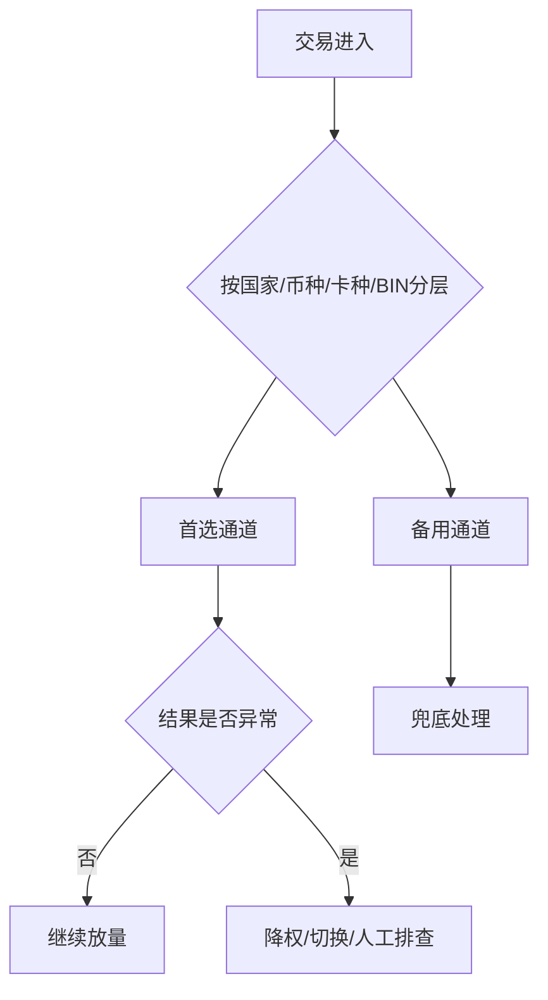

# 收单行、PSP 与通道管理

## 这页解决什么问题

很多支付问题表面上是“成功率不够高”，但往下拆，往往会落到收单行能力、PSP 稳定性、路由策略、商户号配置、地区覆盖和运营协同。这页就是把这些角色和管理动作理清楚。

## 先分清几个角色

### 收单行 `Acquirer`

负责为商户收单、接入卡组织网络、把交易送到后续授权链路。不同收单行在不同国家、币种、商户类型上的表现可能差很多。

### PSP `Payment Service Provider`

通常帮商户封装支付接入、聚合多种支付方式、对接多个收单和风控服务，有时也提供路由、对账、风控、报表等能力。

### 通道

一个更业务化的叫法，可能是某个 PSP、某个收单、某个商户号组合形成的可用交易路径。

## 为什么通道管理是专家能力

因为你最终经营的不是“一个按钮”，而是一张动态网络：

- 哪些国家走哪家收单更强
- 哪些 BIN 在哪家通道表现更好
- 哪些币种应该本地收单
- 哪些时段某个 PSP 会波动
- 哪些高风险场景需要更强认证和更严风控

## 应该从哪些维度评估通道

1. 成功率
2. 授权通过率
3. 认证通过率
4. 拒付率和资损率
5. 费率与综合成本
6. 稳定性与故障恢复能力
7. 国家、币种、卡种覆盖度
8. 对账、报表、工单响应和合作效率

## 通道管理的日常动作

### 准入和评估

- 新通道接入前做国家、币种、卡种和场景覆盖评估
- 看历史表现、费率、路由灵活性、结算周期、风控支持能力

### 上线和灰度

- 不要一上来全量切流量
- 先按国家、支付方式、BIN、商户群灰度验证

### 监控和调优

- 盯成功率、超时率、失败码结构、拒付率、工单响应时效
- 对异常通道做降权、切流、暂停或 failover

### 复盘和淘汰

- 长期表现差、协作成本高、费率不合理的通道要敢于淘汰

## 路由为什么不能只看成功率

某通道成功率高，不代表它一定更好。你还要一起看：

- 费率是否更高
- 拒付是否更高
- 是否对某些高风险交易“过度放行”
- 是否结算慢、对账差、运营协同弱

## 一个成熟的通道策略长什么样

## 业务案例

### 案例 1：单一 PSP 依赖导致大面积失败

场景：某晚单一 PSP 出现超时，团队没有备用路由，导致多个市场支付成功率同时下跌。

真正成熟的通道管理会提前准备：

- 主备通道
- 不同市场的默认通道
- 异常自动降权机制
- 人工切流 SOP

### 案例 2：某通道成功率更高，但拒付也更高

场景：B 通道成功率比 A 高 3 个点，但两个月后发现拒付率高出一倍。

这时不能只说“B 更强”，而要重新看：

- B 是否对高风险交易过度放行
- B 的账单描述、认证策略、商户号画像是否不同
- B 的综合净收益是否真的更优

这正是“通道管理”和“经营判断”结合的地方。

## 通道管理最容易忽略的地方

- 商户号本身的质量和历史表现
- 结算和对账能力
- 拒付处理支持能力
- 本地收单 vs 跨境收单策略
- 单一 PSP 依赖风险

## 常见误区

- 只接一家 PSP，就以为事情结束了
- 把所有问题都归因给通道
- 只按费率选通道
- 没有通道评分和淘汰机制

## 最关键的一句话

通道不是“接上就行”的资源，而是一组需要持续经营、监控和优化的生产能力。

## 关联

- [[支付路由与编排]]
- [[支付成功率优化框架]]
- [[授权链路与发卡行拒绝机制]]
- [[支付监控与告警]]
- [[支付负责人常看报表与指标看板]]
