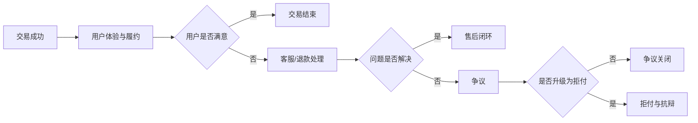

# 退款、争议与拒付全流程

## 这页解决什么问题

很多团队会把退款、争议、拒付混在一起处理，但这三件事的成本、触发方、可控性和处置方式完全不同。真正成熟的支付团队，会把它们当成一条完整的售后资金治理链路来看。

## 先分清三件事

### 退款 `Refund`

通常由商户主动发起，把已支付的资金退回给用户。退款是相对可控的动作。

### 争议 `Dispute`

持卡人、发卡行或通道对一笔交易提出疑问或申诉。争议阶段不一定已经形成正式拒付。

### 拒付 `Chargeback`

发卡行正式把钱从商户侧拉回，是卡类支付里最核心的后验损失机制之一。

## 为什么要把它们放到一条流程里看

因为很多拒付，其实本来可以在更早阶段通过退款、客服解释、履约补证、账单描述优化来避免。

## 全流程长什么样

## 退款策略为什么重要

退款看起来“会损失收入”，但很多时候，及时退款比进入争议和拒付更便宜。

你需要想清楚：

- 哪些场景应优先退款
- 哪些场景先客服解释
- 哪些场景必须收集补充证据
- 哪些场景需要和履约、物流、客服联动

## 常见拒付来源

### 未授权交易

通常偏欺诈与盗刷。

### 商品或服务未收到

偏履约、物流、交付证明问题。

### 持卡人不认识这笔交易

账单描述不清、品牌名不一致、续费提醒不足，经常会触发这类拒付。

### 重复扣款或金额争议

往往和产品逻辑、系统幂等、订阅续费、退款流程有关。

## 什么时候值得抗辩

不是所有拒付都值得抗辩。是否抗辩通常要一起看：

- 原因码类型
- 证据是否充足
- 订单金额
- 抗辩成本
- 胜诉概率
- 是否会影响长期通道关系

## 一套比较成熟的治理动作

1. 做退款原因分类
2. 做争议原因分类
3. 做拒付原因码治理
4. 统一沉淀证据模板
5. 建立账单描述和续费提醒规范
6. 让客服、履约、支付、风控共享同一套 case 视角

## 需要保留哪些证据

- 下单记录
- 登录和设备记录
- IP、地理位置、行为轨迹
- 履约记录、物流签收、服务交付日志
- 用户确认记录
- 客服沟通记录
- 退款和处理历史

## 业务案例

### 案例 1：客服慢半拍，拒付率上来了

场景：数字订阅业务里，用户找客服申请退款没有及时处理，结果几天后直接发起拒付。

这里真正的教训不是“抗辩材料不够”，而是：

- 退款 SLA 太慢
- 客服没有统一处理口径
- 续费提醒和账单描述不够清晰

这说明拒付治理很多时候要前移，而不是只在拒付发生后打补丁。

### 案例 2：明明履约了，还是大量争议

场景：商户确实发货了，但因为物流签收证据、用户确认记录和客服记录分散，抗辩时凑不齐证据链。

成熟团队会把履约和支付放在同一条 case 流里，让证据在交易生命周期内自动沉淀。

## 常见误区

- 把退款当成坏事，把拒付当成不可控天灾
- 所有拒付都抗辩
- 没有证据沉淀流程
- 客服、履约、支付各自为战

## 最关键的一句话

拒付治理的最好状态，不是“抗辩很强”，而是尽量让问题在更早的退款和争议阶段被消化掉。

## 关联

- [[拒付、争议与抗辩]]
- [[拒付与资损治理框架]]
- [[支付风控与封控]]
- [[对账、清结算与资金运营]]
