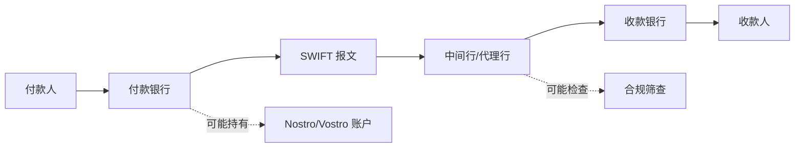

# SWIFT 流程图

## 怎么看这张图

- 实线是“信息和支付指令的大致流向”
- 虚线提醒你：真正的账户关系和合规检查不一定直接显示在用户前台
- 这张图最重要的结论是：`SWIFT` 是通信和指令层，不是“钱自动飞过去”的那一层

## 关联

- [[../05-Topics/SWIFT 与代理行体系|SWIFT 与代理行体系]]
- [[../05-Topics/Nostro 与 Vostro 账户|Nostro 与 Vostro 账户]]
