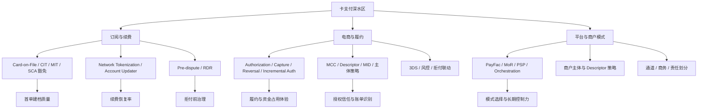

# 卡支付深水区判断图

## 怎么读这张图

- 如果你做 `SaaS`，优先沿着“订阅与续费”这条线读
- 如果你做跨境电商，优先沿着“电商与履约”这条线读
- 如果你做 `Marketplace` 或平台型支付，优先沿着“平台与商户模式”这条线读
- 真正成熟的支付团队，不会把这些主题分开看，而是会同时平衡成功率、拒付、用户体验、主体策略与模式控制力

## 关联

- [[地图索引]]
- [[../05-Topics/卡支付深水区与模式层索引|卡支付深水区与模式层索引]]
- [[../10-Playbooks/SaaS 订阅卡支付判断清单|SaaS 订阅卡支付判断清单]]
- [[../10-Playbooks/跨境电商卡支付判断清单|跨境电商卡支付判断清单]]
- [[../10-Playbooks/Marketplace 卡支付判断清单|Marketplace 卡支付判断清单]]
