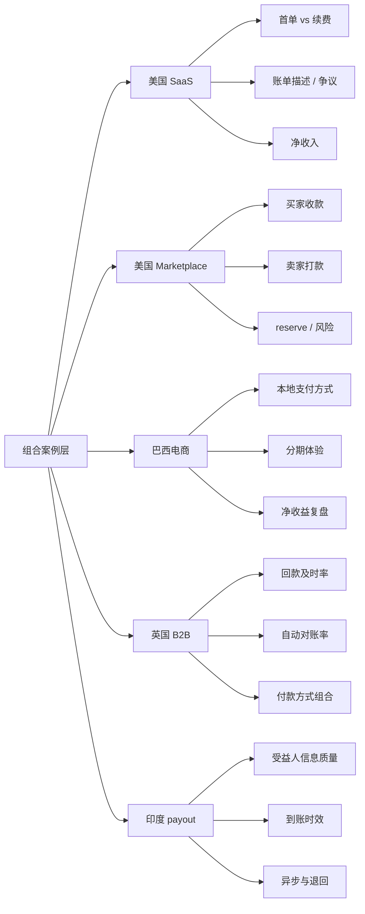

# 国家与场景组合图

```mermaid
flowchart LR
  A["组合案例层"] --> B["美国 SaaS"]
  A --> C["美国 Marketplace"]
  A --> D["巴西电商"]
  A --> E["英国 B2B"]
  A --> F["印度 payout"]

  B --> B1["首单 vs 续费"]
  B --> B2["账单描述 / 争议"]
  B --> B3["净收入"]

  C --> C1["买家收款"]
  C --> C2["卖家打款"]
  C --> C3["reserve / 风险"]

  D --> D1["本地支付方式"]
  D --> D2["分期体验"]
  D --> D3["净收益复盘"]

  E --> E1["回款及时率"]
  E --> E2["自动对账率"]
  E --> E3["付款方式组合"]

  F --> F1["受益人信息质量"]
  F --> F2["到账时效"]
  F --> F3["异步与退回"]
```

## 怎么读这张图

- 左边是最贴近业务现场的组合案例
- 右边是每种组合里最先要抓住的关键矛盾
- 如果你已经知道自己的国家和业务模式，就从这里开始反推该补哪些能力

## 关联

- [[地图索引]]
- [[../11-Combo-Cases/组合案例索引|组合案例索引]]
- [[../10-Playbooks/场景作战索引|场景作战索引]]
