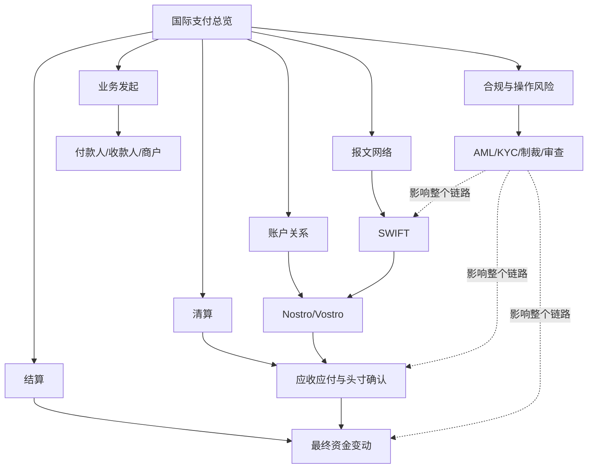

# 国际支付总览图

## 怎么看这张图

- 如果你想理解“跨境支付为什么复杂”，先看六层结构
- 如果你想理解“为什么报文发出不等于到账”，重点看报文层、账户层、清算层、结算层的差别
- 如果你想把业务问题映射到底层原因，就看合规与操作风险如何贯穿整条链路

## 关联

- [[../05-Topics/什么是国际支付基础设施|什么是国际支付基础设施]]
- [[SWIFT 流程图]]
- [[清算与结算关系图]]
