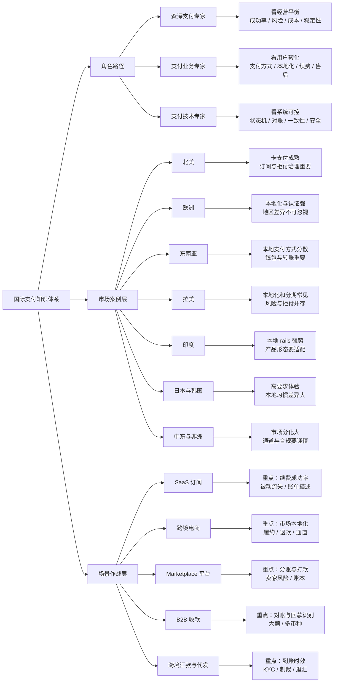

# 市场与场景决策图

## 怎么读这张图

- 先确定你是从角色出发、从市场出发，还是从业务场景出发
- 角色路径解决“你要看什么问题”
- 市场案例层解决“不同地区哪里不一样”
- 场景作战层解决“在具体业务模式里怎样把支付做成系统”

## 关联

- [[地图索引]]
- [[../09-Market-Cases/市场案例索引|市场案例索引]]
- [[../10-Playbooks/场景作战索引|场景作战索引]]
