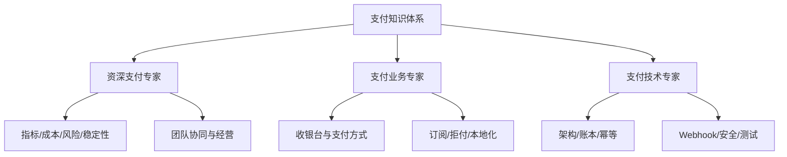

# 支付三类专家视角图

```mermaid
flowchart TD
    A[支付知识体系] --> B[资深支付专家]
    A --> C[支付业务专家]
    A --> D[支付技术专家]

    B --> B1[指标/成本/风险/稳定性]
    B --> B2[团队协同与经营]

    C --> C1[收银台与支付方式]
    C --> C2[订阅/拒付/本地化]

    D --> D1[架构/账本/幂等]
    D --> D2[Webhook/安全/测试]
```

## 关联

- [[../05-Topics/支付三类专家视角|支付三类专家视角]]
- [[支付专家能力总览图]]
