# 支付专家能力总览图

```mermaid
flowchart TD
    A[支付专家能力地图] --> B[业务结果层]
    A --> C[交易机制层]
    A --> D[运营治理层]
    A --> E[底层规则层]
    A --> F[业务专家视角]
    A --> G[技术专家视角]

    B --> B1[支付核心指标体系]
    B --> B2[支付成功率优化框架]
    B --> B3[拒付与资损治理框架]
    B --> B4[支付负责人常看报表与指标看板]
    B --> B5[支付费率、成本与单位经济]

    C --> C1[支付失败码与原因分类]
    C --> C2[授权链路与发卡行拒绝机制]
    C --> C3[3DS 与认证策略]
    C --> C4[支付风控与封控]
    C --> C5[支付路由与编排]
    C --> C6[退款、争议与拒付全流程]
    C --> C7[拒付、争议与抗辩]

    D --> D1[收单行、PSP 与通道管理]
    D --> D2[支付监控与告警]
    D --> D3[对账、清结算与资金运营]
    D --> D4[支付异常排查与事故复盘]
    D --> D5[支付团队能力地图]
    D --> D6[支付上线检查清单]
    D --> D7[拒付抗辩证据清单]

    E --> E1[支付合规实战框架]
    E --> E2[清算与结算]
    E --> E3[SWIFT 与代理行体系]
    E --> E4[跨境支付中的汇兑]
    E --> E5[跨境支付中的卡组织]

    F --> F1[收银台设计与支付体验优化]
    F --> F2[支付方式策略与市场本地化]
    F --> F3[订阅支付与自动续费治理]
    F --> F4[跨境电商支付]

    G --> G1[支付系统架构与核心服务]
    G --> G2[支付账本、交易状态机与幂等设计]
    G --> G3[Webhook、异步通知与一致性]
    G --> G4[PCI DSS、Tokenization 与敏感数据安全]
    G --> G5[支付测试、沙箱与发布治理]

    B4 -.日报/周报/月报支持.-> D2
    C2 -.授权优化依赖.-> D1
    C7 -.抗辩与售后联动.-> D7
    C6 -.售后与资金联动.-> D3
    E1 -.准入与限制影响.-> C4
    F2 -.本地化影响.-> B2
    G2 -.状态一致性支撑.-> D3
```

## 怎么用这张图

- 从左到右看，是“成为支付专家需要掌握哪些层面”
- 从上到下看，是“从经营指标拆到交易机制，再落到日常运营、业务本地化和技术能力”
- 如果你遇到真实业务问题，就先定位它落在哪一层，再顺着图往外扩展

## 关联

- [[../05-Topics/资深支付专家能力体系|资深支付专家能力体系]]
- [[../05-Topics/支付三类专家视角|支付三类专家视角]]
- [[../05-Topics/支付负责人常看报表与指标看板|支付负责人常看报表与指标看板]]
- [[地图索引]]
