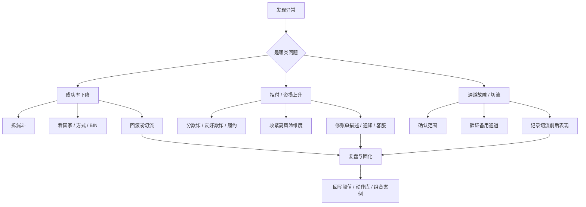

# 支付异常响应图

```mermaid
flowchart TD
  A["发现异常"] --> B{"是哪类问题"}
  B --> C["成功率下降"]
  B --> D["拒付 / 资损上升"]
  B --> E["通道故障 / 切流"]

  C --> C1["拆漏斗"]
  C --> C2["看国家 / 方式 / BIN"]
  C --> C3["回滚或切流"]

  D --> D1["分欺诈 / 友好欺诈 / 履约"]
  D --> D2["收紧高风险维度"]
  D --> D3["修账单描述 / 通知 / 客服"]

  E --> E1["确认范围"]
  E --> E2["验证备用通道"]
  E --> E3["记录切流前后表现"]

  C3 --> F["复盘与固化"]
  D3 --> F
  E3 --> F
  F --> G["回写阈值 / 动作库 / 组合案例"]
```

## 关联

- [[地图索引]]
- [[../12-Runbooks/动作库索引|动作库索引]]
- [[../12-Runbooks/负责人指标阈值清单|负责人指标阈值清单]]
