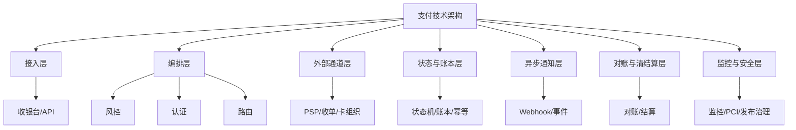

# 支付技术架构图

```mermaid
flowchart TD
    A[支付技术架构] --> B[接入层]
    A --> C[编排层]
    A --> D[外部通道层]
    A --> E[状态与账本层]
    A --> F[异步通知层]
    A --> G[对账与清结算层]
    A --> H[监控与安全层]

    B --> B1[收银台/API]
    C --> C1[风控]
    C --> C2[认证]
    C --> C3[路由]
    D --> D1[PSP/收单/卡组织]
    E --> E1[状态机/账本/幂等]
    F --> F1[Webhook/事件]
    G --> G1[对账/结算]
    H --> H1[监控/PCI/发布治理]
```

## 关联

- [[../05-Topics/支付系统架构与核心服务|支付系统架构与核心服务]]
- [[../05-Topics/支付账本、交易状态机与幂等设计|支付账本、交易状态机与幂等设计]]
- [[../05-Topics/Webhook、异步通知与一致性|Webhook、异步通知与一致性]]
