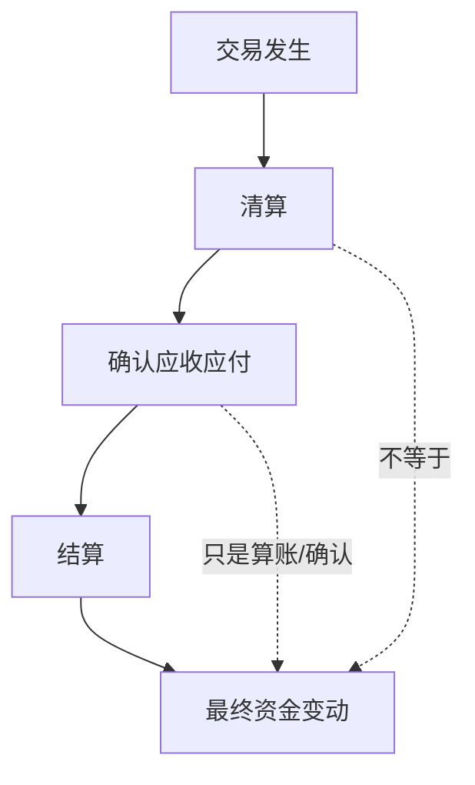

# 清算与结算关系图

```mermaid
flowchart TD
    A[交易发生] --> B[清算]
    B --> C[确认应收应付]
    C --> D[结算]
    D --> E[最终资金变动]

    B -.不等于.-> E
    C -.只是算账/确认.-> E
```

## 怎么看这张图

- `清算` 的重点是确认和计算
- `结算` 的重点是最终变动
- 很多支付系统会把这两个过程拆开处理，所以会天然有时间差和状态差

## 关联

- [[../05-Topics/清算与结算|清算与结算]]
