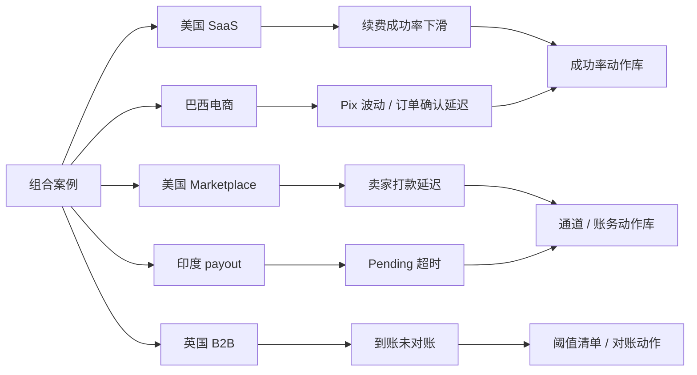

# 组合异常案例图

```mermaid
flowchart LR
  A["组合案例"] --> B["美国 SaaS"]
  A --> C["巴西电商"]
  A --> D["美国 Marketplace"]
  A --> E["英国 B2B"]
  A --> F["印度 payout"]

  B --> B1["续费成功率下滑"]
  C --> C1["Pix 波动 / 订单确认延迟"]
  D --> D1["卖家打款延迟"]
  E --> E1["到账未对账"]
  F --> F1["Pending 超时"]

  B1 --> G["成功率动作库"]
  C1 --> G
  D1 --> H["通道 / 账务动作库"]
  E1 --> I["阈值清单 / 对账动作"]
  F1 --> H
```

## 怎么读这张图

- 左边是已经明确国家和场景的业务
- 中间是这些业务里最典型、最容易让团队卡住的异常
- 右边则提醒你该落回哪类动作库去执行

## 关联

- [[地图索引]]
- [[../13-Incident-Cases/异常案例索引|异常案例索引]]
- [[../12-Runbooks/动作库索引|动作库索引]]
