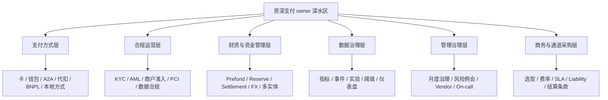

# 高级治理能力图

## 怎么读这张图

- 这不是入门层，而是支付 owner 的进阶层
- 这六层补的是“做大以后还能稳稳管住”的能力
- 真正的资深支付专家，通常不是只懂其中一块，而是至少知道它们之间怎么互相制约

## 关联

- [[地图索引]]
- [[../05-Topics/支付方式层索引|支付方式层索引]]
- [[../05-Topics/合规运营层索引|合规运营层索引]]
- [[../05-Topics/财资与资金管理层索引|财资与资金管理层索引]]
- [[../05-Topics/数据治理层索引|数据治理层索引]]
- [[../05-Topics/管理治理层索引|管理治理层索引]]
- [[../05-Topics/商务与通道采购层索引|商务与通道采购层索引]]
