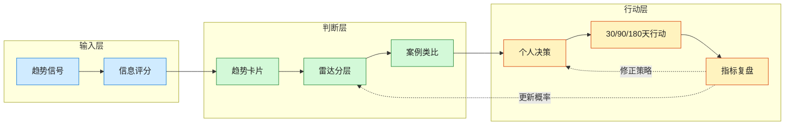

# 从趋势判断到行动转化地图

> 这张图回答：如何把一个趋势，从“看见”变成“可执行的个人策略”？

## 读图方式

1. **趋势信号**：先捕捉变化，但不要立刻下结论。
2. **信息评分**：判断来源层级、激励和可验证性。
3. **趋势卡片**：把事实、解释、反方和验证指标写清楚。
4. **雷达分层**：决定它是 Watch、Probe、Build 还是 Hedge。
5. **案例类比**：寻找历史上类似结构，避免只被当下叙事带走。
6. **个人决策**：把趋势映射到职业、技能、产品、创业和风险。
7. **行动复盘**：用 30/90/180 天指标校准，而不是凭情绪加码。

## 推荐配套

- 信息评分：[[../04-Sources/信息源分层评分体系|信息源分层评分体系]]
- 趋势判断：[[../07-Templates/趋势判断卡片模板|趋势判断卡片模板]]
- 雷达分层：[[../09-Radars/前沿趋势雷达索引|前沿趋势雷达索引]]
- 案例校准：[[../10-Cases/案例库索引|案例库索引]]
- 个人行动：[[../07-Templates/个人策略决策模板|个人策略决策模板]]
- 月度复盘：[[../08-Playbooks/月度宏观与趋势复盘流程|月度宏观与趋势复盘流程]]
