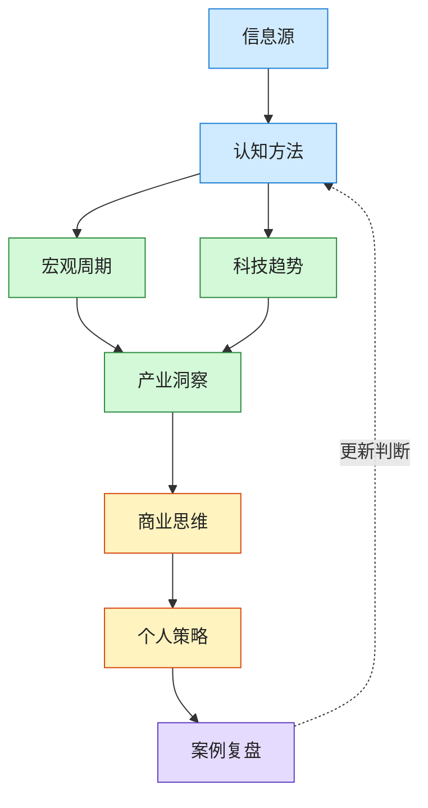

# 宏观认知与趋势判断全景图

> 这张图回答：如何从信息噪音走到可行动的世界模型？

## 图的读法

1. **信息源**：先解决“我看到的东西靠不靠谱”。
2. **认知方法**：再解决“我如何避免被单一叙事带走”。
3. **宏观周期**：理解利率、通胀、就业、资产、人口、政策等背景。
4. **科技趋势**：理解技术成熟度、成本曲线、供应链和应用扩散。
5. **产业洞察**：看趋势落到哪些行业、哪些环节、哪些公司。
6. **商业思维**：判断是否能形成利润、壁垒、组织能力和增长飞轮。
7. **个人策略**：转成职业、技能、产品、创业、财富和时间配置。
8. **案例复盘**：用历史和现实案例反过来校准判断。

## 核心闭环

`观察 -> 解释 -> 判断 -> 行动 -> 复盘 -> 更新模型`

如果只观察不行动，会变成新闻收藏。

如果只行动不复盘，会重复犯错。

如果只看同温层信息，会进入更精致的信息茧房。

## 推荐 Drill-down

- [[../05-Topics/宏观认知与趋势判断全景|宏观认知与趋势判断全景]]
- [[../05-Topics/认知方法与反信息茧房|认知方法与反信息茧房]]
- [[../05-Topics/经济周期与宏观变量|经济周期与宏观变量]]
- [[../05-Topics/科技趋势与产业周期|科技趋势与产业周期]]
- [[../05-Topics/商业思维与决策转化|商业思维与决策转化]]
- [[从趋势判断到行动转化地图]]
