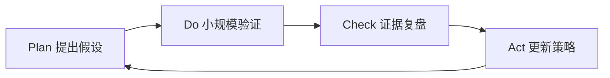

# 世界模型 PDCA 工作流

> 目标：让 `Macro-Insight` 不停留在“看起来很有道理”，而是持续计划、执行、校验、修正。

## PDCA 总览

## Plan：提出假设

每周只提出 1 个主要假设：

> 我认为 `趋势 A` 会在 `时间尺度` 内影响 `行业/职业/产品/资产/组织`，关键变量是 `X/Y/Z`。

要求：

- 有信息源。
- 有反方观点。
- 有可观察指标。
- 有时间尺度。

## Do：小规模验证

验证不等于下注，可以是：

- 读一份一手报告。
- 找一个公司案例。
- 做一个小 demo。
- 和一个行业内的人交流。
- 跟踪一个指标。
- 调整一个学习计划。

## Check：证据复盘

每周检查：

- 新证据支持还是反驳？
- 我是否被情绪带偏？
- 是否出现更强反方？
- 关键变量有没有变化？
- 置信度上升还是下降？

## Act：更新策略

行动只有四类：

| 动作 | 含义 |
|---|---|
| Continue | 继续观察，证据未变 |
| Upgrade | 提高优先级，进入学习/项目 |
| Downgrade | 降低优先级，避免追热点 |
| Stop | 假设失效，归档复盘 |

## 月度 PDCA

每月做一次：

- 更新 [[../09-Radars/2026 前沿趋势观察雷达|2026 前沿趋势观察雷达]]
- 复盘 4 张趋势卡片。
- 选出 1 个进入个人策略的趋势。
- 归档 1 个误判或低质量信息源。
- 新增 1 个案例复盘。

## 判断质量评分

| 维度 | 0 分 | 1 分 | 2 分 |
|---|---|---|---|
| 信息源 | 单一二手观点 | 多源但未分层 | 有一手来源和反方 |
| 时间尺度 | 模糊 | 有大概区间 | 明确短中长期 |
| 机制解释 | 只有结论 | 有因果线 | 有变量和传导链 |
| 行动转化 | 无行动 | 有观察 | 有小实验或策略调整 |
| 复盘 | 无复盘 | 口头复盘 | 有记录和置信度更新 |

## 关联

- [[./每周信息摄入与判断复盘流程|每周信息摄入与判断复盘流程]]
- [[../07-Templates/趋势判断卡片模板|趋势判断卡片模板]]
- [[../09-Radars/前沿趋势雷达索引|前沿趋势雷达索引]]
- [[../10-Cases/案例库索引|案例库索引]]

