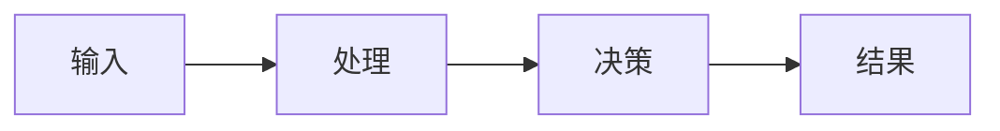

# 领域全貌图模板

## 领域目标

这个领域最终要优化什么？

## 关键角色

| Role | Goal | Risk | Power |
|---|---|---|---|
|  |  |  |  |

## 核心对象

- 

## 关键流程

## 核心指标

| Metric | Meaning | Tension |
|---|---|---|
|  |  |  |

## 关键问题

- 

## 解决方案族

| Solution Family | Works When | Fails When |
|---|---|---|
|  |  |  |

## 失败模式

- 

## 专家问题

- 

## 学习路径

1. 
