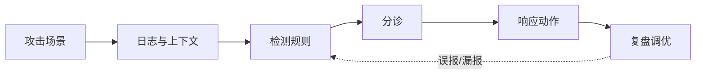

# SOC、SIEM、SOAR 与 XDR 平台

> SecOps 平台的目标不是“收最多日志”，而是让关键攻击路径可见、可判断、可响应、可复盘。

## 能力边界

| 子能力 | 解决的问题 | 常见平台形态 |
|---|---|---|
| Log Pipeline | 日志接不进、格式乱 | Collector、Agent、Kafka、OTel |
| SIEM | 关联分析与告警 | Microsoft Sentinel、Splunk ES、Elastic、Wazuh |
| SOAR | 响应编排和自动化 | Playbook、Case、审批、隔离、封禁 |
| EDR / XDR | 终端与跨域检测 | 终端行为、身份、邮件、云、网络关联 |
| NDR | 网络层异常 | 流量、东西向移动、C2 |
| Threat Intel | 威胁情报上下文 | IOC、TTP、信誉、活动组织 |
| Case Management | 分诊与复盘 | 事件工单、时间线、证据 |

## 最小日志源

- 身份：登录、MFA、异常登录、高权限操作。
- 云：控制面操作、IAM 变更、存储访问、网络变更。
- 应用：认证、授权失败、关键业务操作、管理后台操作。
- 数据：敏感表访问、批量导出、权限变更。
- 终端：进程、网络连接、恶意行为、隔离动作。
- CI/CD：secret、构建、发布、runner、制品。

## 检测工程闭环

## 选型检查点

- 是否能接入关键日志源，并保留足够字段和时间？
- 是否支持规则版本化、测试、模拟和误报治理？
- 是否能把告警转成 case，并绑定 owner、SLA、证据？
- SOAR 自动化是否支持审批、回滚和人工确认？
- 是否能按 MITRE ATT&CK 或业务攻击路径衡量覆盖率？

## 关键指标

- MTTD / MTTR
- 告警有效率
- 关键攻击场景检测覆盖率
- 自动化响应成功率
- 重复告警下降率
- 事件复盘转控制改进率

## 典型陷阱

- 买 SIEM 但没有检测工程。
- 收全量日志但没有场景和分诊。
- SOAR 自动封禁没有审批和回滚。
- MDR 外包后内部不沉淀资产、场景和响应能力。

## 官方资料入口

- [Microsoft Sentinel](https://learn.microsoft.com/en-us/azure/sentinel/)
- [Splunk Enterprise Security](https://www.splunk.com/en_us/products/enterprise-security.html)
- [Elastic Security](https://www.elastic.co/guide/en/security/current/index.html)
- [Wazuh Documentation](https://documentation.wazuh.com/)

## 关联

- [[../05-Topics/安全运营、检测与响应|安全运营、检测与响应]]
- [[../06-Maps/安全运营与事件响应闭环图|安全运营与事件响应闭环图]]
- [[../08-Playbooks/SOC 检测工程 Playbook|SOC 检测工程 Playbook]]
- [[../08-Playbooks/安全事件响应 Playbook|安全事件响应 Playbook]]

