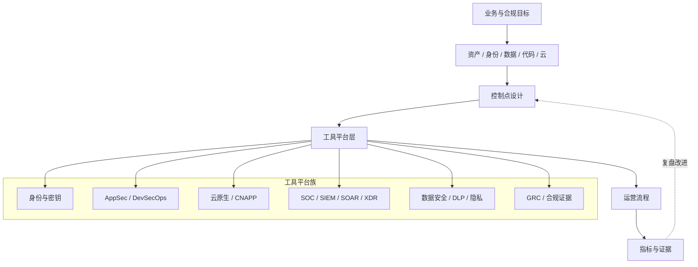

# 安全工具平台总览

> 安全工具平台不是“买一套软件”。它是把安全控制嵌入研发、云、身份、数据、运营和审计流程的能力载体。

## 上帝视角

## 平台成熟度

| 阶段 | 典型状态 | 主要风险 | 应该补什么 |
|---|---|---|---|
| L0 手工响应 | 靠人查日志、Excel 跟漏洞 | 遗漏、不可复盘 | 资产、owner、最小日志 |
| L1 单点工具 | 有扫描器/EDR/IdP，但割裂 | 工具很多，闭环很弱 | 工单、SLA、例外、验证 |
| L2 流程集成 | 工具接入 CI/CD、云、工单 | 指标粗糙、噪声高 | 风险优先级、检测场景 |
| L3 平台化 | 默认安全能力嵌入研发和云平台 | 变更治理复杂 | 策略即代码、自动证据 |
| L4 自适应治理 | 风险、控制、检测、证据联动 | 组织协同成本高 | 业务风险建模、持续改进 |

## 常见平台族

如果要从开源项目开始建立手感，先看 [[./GitHub 热门开源安全工具雷达|GitHub 热门开源安全工具雷达]]，再决定哪些工具适合进入实验室、CI/CD 或企业平台。

### 身份、密钥与访问

- 目标：确保“正确的人、设备、服务，在正确条件下访问正确资源”。
- 常见能力：SSO、MFA、Lifecycle、PAM、JIT、Secrets、KMS、证书、机器身份。
- 关键指标：MFA 覆盖率、高权限账号数量、长期凭据数量、密钥轮换率、异常登录闭环率。
- 入口：[[./身份、密钥与访问平台|身份、密钥与访问平台]]

### 应用安全与 DevSecOps

- 目标：把安全检查前移到设计、代码、依赖、构建、发布和运行前。
- 常见能力：SAST、SCA、DAST、Secret Scanning、IaC Scan、SBOM、签名、Release Gate。
- 关键指标：高危漏洞进入生产率、依赖修复 SLA、secret 泄露修复时间、安全门禁误报率。
- 入口：[[./应用安全与 DevSecOps 平台|应用安全与 DevSecOps 平台]]

### 云原生安全与 CNAPP

- 目标：统一管理云配置、身份权限、容器、Kubernetes、工作负载和运行时风险。
- 常见能力：CSPM、CWPP、KSPM、CIEM、IaC Scan、镜像扫描、运行时检测。
- 关键指标：公网暴露资产、云 IAM 过权、公开存储桶、K8s 高危配置、运行时异常。
- 入口：[[./云原生安全与 CNAPP 平台|云原生安全与 CNAPP 平台]]

### SOC、SIEM、SOAR 与 XDR

- 目标：让关键攻击路径被看见、被判断、被响应、被复盘。
- 常见能力：日志采集、规则检测、行为分析、告警分诊、SOAR 编排、EDR/XDR、威胁情报。
- 关键指标：MTTD、MTTR、告警有效率、检测覆盖率、自动化响应成功率。
- 入口：[[./SOC、SIEM、SOAR 与 XDR 平台|SOC、SIEM、SOAR 与 XDR 平台]]

### 数据安全、DLP 与隐私

- 目标：知道敏感数据在哪里、怎么流动、谁访问、如何最小化和证明合规。
- 常见能力：数据发现、分类分级、DLP、DSPM、脱敏、Tokenization、隐私请求、数据保留删除。
- 关键指标：敏感数据覆盖率、未授权访问、DLP 阻断与误报、跨境数据流、DSAR 完成时间。
- 入口：[[./数据安全、DLP 与隐私平台|数据安全、DLP 与隐私平台]]

### GRC、合规与证据

- 目标：把控制要求、风险、例外、审计证据和责任人变成可追踪系统。
- 常见能力：控制库、风险登记、供应商评估、证据自动采集、审计任务、合规报告。
- 关键指标：控制有效率、证据自动化率、风险逾期率、审计发现关闭率。
- 入口：[[./GRC、合规与证据平台|GRC、合规与证据平台]]

## 典型落地误区

- 误区一：以为 SIEM 等于 SOC。没有检测工程、分诊、响应 owner，SIEM 只是日志仓库。
- 误区二：以为 SAST 等于 DevSecOps。没有修复 SLA、误报治理和 release gate，扫描只是报告。
- 误区三：以为 CNAPP 等于云安全。没有云账号治理、IaC 基线和修复流程，发现不会转成控制。
- 误区四：以为 GRC 等于合规。没有证据自动化和控制 owner，GRC 只是审计前填表。
- 误区五：以为买更多工具就更安全。工具越多，集成和运营越难。

## 最小可落地组合

- 初创 / 小团队：IdP + MFA、Secret 管理、SCA/Secret Scanning、云基线扫描、基础日志与告警、轻量 GRC 表格。
- 成长期 SaaS：SSO/MFA/PAM、SAST/SCA/DAST、CNAPP、EDR、SIEM 或托管 MDR、DLP/数据地图、合规自动化。
- 强监管企业：IAM/PAM/Secrets、DevSecOps 平台、CNAPP、SIEM/SOAR/XDR、自建或混合 SOC、DSPM/DLP、GRC/IRM、审计证据自动化。

## 官方资料入口

> 以下是示例来源，不是采购推荐或背书。选型要回到本组织的问题、约束和集成条件。

- SIEM/SOAR/XDR 示例：[Microsoft Sentinel](https://learn.microsoft.com/en-us/azure/sentinel/)、[Splunk Enterprise Security](https://www.splunk.com/en_us/products/enterprise-security.html)、[Elastic Security](https://www.elastic.co/guide/en/security/current/index.html)、[Wazuh](https://documentation.wazuh.com/)
- 身份与密钥示例：[Okta Workforce Identity](https://www.okta.com/workforce-identity/)、[CyberArk Privileged Access Manager](https://www.cyberark.com/products/privileged-access-manager/)、[HashiCorp Vault](https://developer.hashicorp.com/vault/docs)、[OpenBao](https://openbao.org/docs/)
- AppSec 示例：[GitHub Advanced Security](https://docs.github.com/en/get-started/learning-about-github/about-github-advanced-security)、[Semgrep](https://semgrep.dev/docs/)、[OWASP Dependency-Check](https://owasp.org/www-project-dependency-check/)、[Snyk Docs](https://docs.snyk.io/)
- 云原生示例：[Wiz](https://www.wiz.io/)、[Prisma Cloud Docs](https://docs.prismacloud.io/)、[Aqua Security](https://www.aquasec.com/)、[Falco Docs](https://falco.org/docs/)
- GRC 与策略示例：[ServiceNow IRM](https://www.servicenow.com/products/integrated-risk-management.html)、[Vanta](https://www.vanta.com/)、[Drata](https://drata.com/)、[Open Policy Agent](https://www.openpolicyagent.org/docs/latest/)

## 关联

- [[./工具平台分类索引|工具平台分类索引]]
- [[../06-Maps/安全工具平台能力地图|安全工具平台能力地图]]
- [[../08-Playbooks/安全工具平台选型与落地 Playbook|安全工具平台选型与落地 Playbook]]
- [[../安全决策导航|安全决策导航]]
